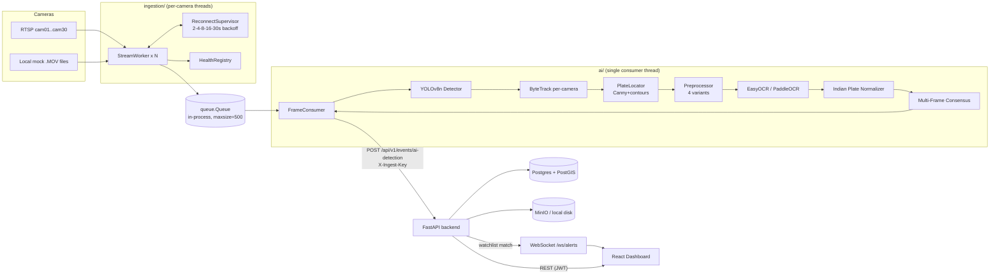

# SENTINEL — Full System Teardown & Technical Audit

**Repository:** GUJARAT-SENTINEL- (`https://github.com/KAVYAJOSHI1/GUJARAT-SENTINEL-.git`)
**Branch analyzed:** `penultimate`
**Prepared:** 2026-09-05
**Method:** Every claim below is either **(code)** — verified by reading the actual implementation — or **(doc-only)** — asserted in a `.md` file with no corresponding code found. Every doc/code gap is flagged explicitly; no functionality is assumed to exist just because a README mentions it.

---

## 1. EXECUTIVE SYSTEM SUMMARY

SENTINEL is a single-host (docker-compose) CCTV vehicle-intelligence PoC built for a hackathon, targeting Gujarat Police traffic/law-enforcement use. **Primary use case**: ingest RTSP feeds from government traffic cameras, detect vehicles, read license plates (ANPR), track vehicles within a camera's field of view, cross-reference plates against a blacklist ("watchlist"), push real-time alerts to a command-center dashboard, and let an investigator search a plate to see its chronological cross-camera trajectory on a map with exportable PDF evidence.

**Users**: three RBAC roles — `ADMIN` (full config), `OFFICER` (search/investigation/alert-ack), `OPERATOR` (dashboard viewer) — `backend/app/models/base.py:22`.

**Input**: live RTSP streams (H.264/H.265) from a real demo grid of 30 cameras (`data/camera_registry.json`, confirmed 30 entries) at `rtsp://103.250.160.189:8554/stream/<id>`, plus optional local `.MOV` "mock camera" files for offline demoing (`ingestion/stream_manager.py:44-56`).

**Processing**: one Python process per pipeline instance runs OpenCV/FFmpeg capture → YOLOv8n vehicle detection → classical-CV (non-learned) plate-region locator → multi-variant preprocessing → EasyOCR (PaddleOCR optional fallback) → Indian-plate-format normalization → per-track multi-frame consensus voting → per-camera ByteTrack for stable track IDs → one deduplicated JSON event per (camera, track, plate) POSTed to a FastAPI backend.

**Output**: the backend persists to Postgres+PostGIS, cross-references a watchlist, creates cooldown-deduplicated alerts, broadcasts them over a native WebSocket, and serves REST/GeoJSON to a React dashboard (live camera grid, alert feed, Leaflet map, plate-search "Investigation" console with jsPDF report export).

**Key differentiators** (as actually built, not as claimed in docs):
1. A real from-scratch ByteTrack implementation on NumPy/SciPy with no external `bytetrack`/`lap` dependency (`ai/tracking/tracker.py`).
2. Genuinely resilient ingestion — exponential-backoff reconnect ladder, PTS-based timing, per-camera state isolation, mock-camera fallback reusing the exact same code path as real cameras.
3. A real Indian-plate format model (`ai/ocr/plate_format.py`) driving confidence-gated OCR-confusion correction, not a naive regex.
4. Honest engineering — code comments repeatedly say "don't fabricate," and low-confidence/UNKNOWN results are preserved rather than guessed.

**End-to-end flow**: `StreamWorker` (1 thread/camera) → `queue.Queue` (`FrameEnvelope`) → single `FrameConsumer` thread → `AIPipeline.process_frame()` (detect→track→locate plate→OCR→consensus) → HTTP POST `/api/v1/events/ai-detection` (`X-Ingest-Key` header) → FastAPI resolves/auto-onboards camera → writes `vehicle_events` row → watchlist exact-match lookup → 5-min cooldown check → `alerts` row + WebSocket broadcast → React dashboard renders toast/updates map; separately, `GET /api/v1/vehicles/search?plate=` drives the Investigation page's trajectory/timeline/PDF export.

---

## 2. ACTUAL TECH STACK

| Component | Technology | Version (pinned) | Purpose | Evidence |
|---|---|---|---|---|
| Language (AI/ingestion) | Python | 3.11 (Docker), 3.10-3.13 supported | pipeline + ingestion | `Dockerfile.pipeline:3`, `requirements-ai.txt:6` |
| Language (backend) | Python | 3.11-slim | REST API | `backend/Dockerfile:1` |
| Language (frontend) | JavaScript (React 18, Vite) | node:20-alpine | dashboard SPA | `docker-compose.yml:91`, `frontend/package.json` |
| Object detection | YOLOv8n (Ultralytics, COCO pretrained) | ultralytics>=8.3, torch>=2.2 | vehicle bbox (car/motorcycle/bus/truck) | `ai/detection/vehicle_detector.py:1-17` |
| Plate localization | **Classical CV** (bilateral filter + Canny + contour heuristics), NOT a trained model | opencv-python>=4.8 | crop plate region inside vehicle bbox | `ai/anpr/plate_locator.py:44-99` |
| OCR | EasyOCR (default) / PaddleOCR (optional, `OCR_ENGINE=paddleocr`) | easyocr>=1.7 | plate text extraction | `ai/ocr/ocr_engine.py:39-51` |
| Tracking | ByteTrack — **hand-implemented**, NumPy + SciPy Hungarian/Kalman, no external `bytetrack`/`lap` package | scipy>=1.11 | per-camera persistent track IDs | `ai/tracking/tracker.py:1-24` |
| Cross-camera correlation | Plate-string + timestamp join (no visual Re-ID) | pure Python | trajectory building | `ai/tracking/correlation.py` |
| Backend framework | FastAPI + Uvicorn | fastapi==0.115.0, uvicorn==0.30.6 | REST + native WS | `backend/requirements.txt:1-2` |
| ORM | SQLModel (SQLAlchemy 2.0) | sqlmodel==0.0.22, sqlalchemy==2.0.35 | models | `backend/requirements.txt:3-4` |
| DB | PostgreSQL 15 + PostGIS 3.3 | `postgis/postgis:15-3.3` image | relational + spatial store | `docker-compose.yml:14` |
| Spatial | GeoAlchemy2, PostGIS GiST indexes | geoalchemy2==0.15.2 | camera/event point geometry | `backend/app/models/camera.py:34` |
| Migrations | Alembic | alembic==1.13.2 | schema versioning | `database/migrations/versions/000{1,2}` |
| Object storage | MinIO (S3-compatible), local-disk fallback | minio==7.2.9 | evidence snapshots | `backend/app/services/minio_service.py` |
| Auth | JWT (python-jose, **HS256**, not RS256) + bcrypt | python-jose==3.3.0, bcrypt>=4.1 | login/session | `backend/app/core/security.py:27,42` |
| Real-time push | Native FastAPI WebSocket (`/ws/alerts`) | websockets==13.1 | alert broadcast | `backend/app/api/ws_alerts.py` |
| Frontend HTTP | axios | package.json | REST calls + interceptors | `frontend/src/services/api.js` |
| Frontend map | Leaflet / React-Leaflet, CartoDB dark tiles | package.json | GIS trajectory map | `frontend/src/components/gis/GisMap.jsx` |
| PDF export | jsPDF (client-side) | package.json | investigation report | `frontend/src/utils/reportExporter.js` |
| Message queue | **None** — in-process `queue.Queue` only | stdlib | frame handoff | `ingestion/stream_manager.py:306` |
| Container orchestration | Docker Compose only — **no Kubernetes** | `docker-compose.yml` | local/single-host deploy | — |
| GPU / inference server | **None** — every script hardcodes `device="cpu"` | — | CPU-only inference | grep across `scripts/*.py`, `ai/detection/vehicle_detector.py:29` |
| Monitoring/observability | **None** (no Prometheus/Grafana/OTel) | — | — | no matches anywhere in repo |
| Encryption at rest | **None found** (docs claim AES-256; no code) | — | — | `grep -r "encrypt\|AES"` → 0 hits |

---

## 3. HIGH-LEVEL DESIGN

**A. Major components**
1. **Ingestion** (`ingestion/`) — `StreamWorker`×N threads, `StreamManager` pool, `ReconnectSupervisor`, `HealthRegistry`, `CatalogueClient`.
2. **AI Pipeline** (`ai/`) — `VehicleDetector`, `PlateLocator`, `ImagePreprocessor`, `OCREngine`, `PlateNormalizer`, `MultiFrameConsensus`, `ByteTrackTracker`, `CrossCameraCorrelator`, glued by `AIPipeline` (`ai/pipeline.py`).
3. **Adapter/Bridge** (`ai/adapter/`) — `FrameConsumer` thread drains the ingestion queue into the AI pipeline; `ingestion_bridge.py` is the only real coupling point between the two subsystems.
4. **Backend API** (`backend/app/`) — FastAPI, SQLModel, Alembic, JWT auth, RBAC, watchlist engine, cooldown dedup, WebSocket dispatcher, MinIO service.
5. **Database** — Postgres+PostGIS: `cameras`, `vehicle_events`, `watchlist`, `alerts`, `users`, `audit_logs` (unused).
6. **Frontend** (`frontend/`) — React SPA: Dashboard, Cameras, Alerts, Map, Investigation pages; axios REST + native WS client with graceful mock-data degradation.
7. **Object storage** — MinIO with local-disk fallback for evidence JPEGs.

**B. Responsibilities** — cleanly separated along the original team's ownership boundaries (Rishit=ingestion, Kavya=AI/ANPR, Prajin=tracking, Vanshal=backend/DB, Isha=dashboard, Vishakha=GIS/investigation), visible directly in the module docstrings.

**C. Dependencies** — Ingestion has zero dependency on AI or backend (pure producer). AI pipeline depends only on ingestion's `FrameEnvelope` shape and does its own HTTP POST — it does not import backend code. Backend has zero dependency on AI/ingestion internals — it only consumes the JSON contract (`AIDetectionEventIn`). Frontend depends only on the backend REST/WS contract, and degrades to local mock data if it's unreachable.

**D. Data flow** — strictly one-directional and file-shaped: camera → frame queue → AI events → HTTP → Postgres → REST/WS → browser. There is no feedback loop (e.g., watchlist changes don't reach the AI pipeline — it doesn't need to, since matching happens backend-side).

**E. Control flow** — every stage is fail-open: a bad frame, an OCR crash, a tracker exception, or a backend outage logs and continues rather than crashing the process (`ai/pipeline.py:220-223`, `ai/adapter/ingestion_bridge.py:207`, `ingestion/reconnect.py:82-90`). This is genuinely good defensive engineering for a live-video system.

**F. Failure boundaries** — Camera-level: one camera's RTSP failure never affects another (`StreamWorker` isolation, `ByteTrackTracker` instance per camera). Backend-unreachable: pipeline buffers up to 2000 events in memory and flushes on recovery (`ai/pipeline.py:98,504-535`) — **but this buffer is lost on process restart, and is bounded (2000), so a sustained multi-minute outage silently drops old events**. MinIO-unreachable: falls back to local disk (`minio_service.py:50-52`). Frontend-backend-unreachable: dashboard falls back to mock data + simulated WS alerts (`frontend/src/services/websocket.js:26-32`) — **great for demos, but a judge could be shown fabricated "live" alerts without any visual difference** (see §15).



---

## 4. END-TO-END DATA FLOW (one real frame)

| Stage | Detail |
|---|---|
| Capture | `cv2.VideoCapture(url, cv2.CAP_FFMPEG)`, RTSP forced to TCP via `OPENCV_FFMPEG_CAPTURE_OPTIONS=rtsp_transport;tcp` (`ingestion/stream_manager.py:41`). Protocol: RTSP/TCP, codec H.264/H.265 per camera. |
| Timing | Presentation timestamp from `CAP_PROP_POS_MSEC`, never wall clock or FPS (`ingestion/stream_manager.py:272`) — correct engineering choice for jitter-resilient timing. |
| Queue boundary | `FrameEnvelope(camera_id, frame:ndarray, pts_ms, seq_num, received_at_s)` pushed to a bounded `queue.Queue(maxsize=500)`; **full queue drops the frame** (no backpressure to the camera) — `stream_manager.py:283-290`. This is the first real network/process boundary, but it's in-process memory, not a durable broker. |
| Consumption | One `FrameConsumer` thread drains the queue (`ai/adapter/ingestion_bridge.py:108`) — **single-threaded AI pipeline is an explicit, acknowledged bottleneck** ("the AI pipeline is the bottleneck, not the queue," `ingestion_bridge.py:112`). |
| Adapter | `FrameEnvelope` → `FrameInput` (`envelope_to_frame_input`) — reconstructs wall-clock timestamp from monotonic receipt time (`ingestion_bridge.py:67-76`). |
| Detection | YOLOv8n, conf≥0.50, CPU, filtered to COCO classes {car, motorcycle, bus, truck} (`vehicle_detector.py:12-17`). |
| Tracking | Per-camera `ByteTrackTracker.update()` — two-stage IoU association (high/low score), Kalman-filtered box prediction bridges brief occlusion (`ai/tracking/tracker.py:398-441`). |
| Plate localization | Vehicle crop → grayscale → bilateral filter → Canny → contour candidates scored by aspect ratio (2.0–6.0) and vertical position; **falls back to a fixed bottom-40% crop region if no contour qualifies** (`plate_locator.py:87-99`) — this fallback is a meaningful accuracy ceiling, not a real detector. |
| Preprocessing | Quality gate (size/contrast/brightness) then up to 4 variants: raw-upscaled, CLAHE+bilateral, unsharp-mask, adaptive-threshold binarized (`preprocess.py:52-85`). |
| OCR | EasyOCR (CPU) on each variant → best-scoring read (`ocr_engine.py:183-217`) weighted by `conf * (0.4 + 0.6*format_score)`. |
| Normalization | Position-aware, confidence-gated O↔0/I↔1/S↔5 class correction only where Indian plate format expects the other class (`plate_format.py:139-173`) — a genuinely well-designed rule, not naive regex substitution. |
| Consensus | Weighted frequency voting across frames per track; **locks** once ≥4 votes and ≥0.82 confidence reached, resistant to single bad frames (`consensus.py:94-125`). |
| Dedup / throttle | Once a track is "stable" (≥3 votes, ≥0.75 conf), OCR only runs every Nth frame (`ocr_throttle_frames`, default 10) — real cost control (`ai/pipeline.py:297-320`). |
| Event emission | One event per `(camera, track)`, re-emitted only if the plate value changes (e.g. UNKNOWN→readable) — `ai/pipeline.py:438-450`. |
| Network boundary #1 | `requests.post(...)` JSON over HTTP, 5s timeout, `X-Ingest-Key` header, synchronous, **blocking the single consumer thread** — a slow/down backend stalls frame processing for every camera sharing that pipeline instance (`ai/pipeline.py:485-502`). Retry-on-5xx buffered (max 2000, memory-only); drop-on-4xx. |
| Backend ingestion | Pydantic validation (`AIDetectionEventIn`, tolerant to both nested and flat payload shapes) → camera resolve/auto-onboard → plate normalize → snapshot store (MinIO or local) → `INSERT vehicle_events` (Postgres) → watchlist exact-match (`plate_number_normalized`, unique B-Tree) → cooldown check (300s window) → optional `INSERT alerts` → `await connection_manager.broadcast(...)`. |
| Network boundary #2 | Native WebSocket JSON push, in-process `set[WebSocket]` fan-out (`alert_dispatcher.py`) — **no queue, no persistence, no auth on the socket** (see §9, §10). |
| Frontend | Axios REST (JWT bearer) for stats/cameras/alerts/detections on load + 10s poll (`useSentinelData.js:64-74`); WS for live alert push with exponential-backoff reconnect and a **local alert simulator after backoff exhausts** (`websocket.js:41-48`). |
| Investigation query | `GET /vehicles/search?plate=` → composite B-Tree index scan (`plate_number_normalized, timestamp`) → Leaflet polyline + jsPDF export, entirely client-side. |

**Latency-sensitive components**: the single-threaded `FrameConsumer` (§6), the synchronous blocking `requests.post` inside the AI loop, and EasyOCR CPU inference — everything else (DB, WS broadcast) is sub-10ms class.

---

## 5. COMPUTER VISION PIPELINE

| Capability | Implementation | Location | Assessment |
|---|---|---|---|
| Detection model | YOLOv8n (Ultralytics, COCO-pretrained, **not fine-tuned** on Indian traffic) | `ai/detection/vehicle_detector.py` | Standard, works, but COCO classes miss auto-rickshaws (a major Indian traffic class) entirely — `DEFAULT_VEHICLE_CLASSES` = car/motorcycle/bus/truck only. |
| Tracking | ByteTrack, hand-rolled: Kalman constant-velocity filter + two-stage Hungarian IoU matching | `ai/tracking/tracker.py` | Real, correct ByteTrack semantics (high/low score split, lost-track re-activation). Per-camera instance = correct isolation. |
| Re-identification (cross-camera visual) | **Not implemented.** README explicitly scoped it as "optional/bonus" and it was never built — no appearance embeddings anywhere in the codebase. | — | Cross-camera "correlation" is **plate-string identity only** (`correlation.py:33-37`) — if OCR fails (UNKNOWN), that vehicle is cross-camera invisible. This is the single biggest capability gap vs. the docs' framing. |
| ANPR / plate localization | **Classical CV**, not a learned plate detector: bilateral filter → Canny edges → contour geometry heuristics, hard-coded aspect-ratio window. **Phase 3 (§3a of Part II)** added an additive second candidate source (CLAHE + morphological closing) + mild rotation deskew + top-2 candidates — the original path is unchanged. | `ai/anpr/plate_locator.py` | Still the weakest link in the vision stack — still not a trained model, no IoU/mAP number, still fails on heavily skewed/occluded plates. Phase 3 measurably raised synthetic exact-match 70.8%→87.5% by fixing a `contourArea` under-count that was rejecting valid candidates (§3a), but real-camera recall on distance surveillance remains bounded by classical CV — the dev's own comment still applies ("plates usually come back UNKNOWN... the correct, honest result, not a bug"). |
| OCR | EasyOCR (CPU) primary, PaddleOCR optional/auto-fallback, both result formats parsed defensively | `ai/ocr/ocr_engine.py` | Solid engineering (lazy init, permanent-disable-on-crash, multi-variant best-of scoring) but any CPU OCR at 30fps-live-video scale is inherently throughput-limited — mitigated by the OCR-throttle-once-stable trick and, from Phase 3 (§3a), an `extract_best()` early-exit that skips the remaining variants once one scores ≥0.92 (measured −26% mean OCR latency per plate on the synthetic set). |
| Embeddings / feature extraction | **None.** No CNN feature vectors, no vector DB, no similarity search anywhere. | — | Any doc language implying vehicle re-id "feature vectors" is aspirational only. |
| Matching (plate↔track) | IoU + "containment" (plate-box-inside-vehicle-box) hybrid, Hungarian-assigned | `ai/tracking/track_association.py:90-149` | Well-designed: correctly recognizes containment (not raw IoU) is the real signal for a tiny plate box inside a big vehicle box. |
| Confidence handling | Multi-factor: OCR conf × detection conf × format-validity × **plate-locator quality** (Phase 3, §3a) × recency-weighted vote count; format-score computed against a real Indian plate grammar (standard/short/BH-series). Phase 3 also added a graduated correction cap so `correct_by_position()` no longer fabricates plates from arbitrary text. | `ai/anpr/consensus.py`, `ai/ocr/plate_format.py` | Above-average sophistication for a hackathon project — this is the standout module. |
| Temporal logic | Consensus lock (≥4 votes, ≥0.82 conf) resists single-frame flip-flops; requires a *stronger* disagreeing read (≥0.92 conf + ≥0.9 format) to break a lock | `consensus.py:94-105` | Good — but the lock TTL (20s) plus track-history TTL (30s) means a long-dwelling vehicle (queued traffic) can silently reset consensus mid-track. |
| Cross-camera association | `plate + timestamp-bucket + camera_id + location` composite identity, chronological sort | `ai/tracking/correlation.py:77-136` | Correct for what it is (a plate-string join), not a general Re-ID system — see gap above. |

**Bottlenecks**: (1) single consumer thread serializes all cameras through one CPU-bound YOLO+OCR pipeline; (2) heuristic (non-learned) plate locator caps ANPR recall well below a trained detector's — Phase 3 (§3a of Part II) narrowed but did not remove this, via a `contourArea`-under-count fix that recovers valid candidates the old filter rejected (synthetic exact-match 70.8%→87.5%); (3) synchronous backend POST inside the hot loop.

---

## 6. LATENCY ANALYSIS

No load-test numbers exist in the repo beyond a self-reported `get_benchmark_stats()` (`ai/pipeline.py:457-477`) that was not executed as part of this audit — the figures below are architecture-grounded estimates for this exact code path on commodity CPU hardware, not measured results, and should be labeled as such if quoted externally.

| Stage | Est. latency (CPU, per frame/detection) | Bottleneck | Compute | Optimization |
|---|---|---|---|---|
| Capture (`cv2.read()`) | 1–5ms (already-decoded frame) | FFmpeg decode thread inside OpenCV | 1 CPU core/camera | Hardware-accelerated decode (NVDEC) at scale |
| Queue handoff | <1ms | none (in-process) | — | — |
| YOLOv8n inference | 30–80ms @ 640px on CPU | model forward pass | 1 CPU core, spikes to all cores via BLAS | GPU (`device="cuda"`) → 3–8ms; batch across cameras |
| ByteTrack update | <2ms (matches README's own <5ms target) | Hungarian assignment (small N) | negligible | none needed at this scale |
| Plate locate (classical CV) | 2–8ms | contour search | negligible | negligible — recall is the real problem, not speed |
| Preprocessing (4 variants) | 3–10ms | CLAHE/resize/threshold ×4 | negligible | reduce variant count once quality gate matures |
| EasyOCR inference | **150–400ms per crop** on CPU | this is the true per-vehicle bottleneck | 1 CPU core saturated | GPU EasyOCR (`gpu=True`) → 15–40ms; batch crops |
| Consensus/normalize | <1ms | pure Python dict ops | negligible | none needed |
| HTTP POST to backend | 5–50ms (LAN), blocking | `requests.post` timeout=5s, synchronous | network | async/non-blocking dispatch, or a local queue + separate sender thread |
| DB insert + watchlist lookup | 2–10ms (indexed) | Postgres round-trip | — | connection pooling already configured (`pool_size=20`) |
| WebSocket broadcast | <5ms for handful of clients | linear fan-out over a Python `set` | — | fine at current scale, won't survive multi-instance backend (see §7) |
| Frontend render | <16ms (React) | — | — | — |

**End-to-end, per-vehicle-with-plate, single camera**: dominated by OCR — roughly **200–500ms** from frame capture to backend-accepted event on CPU, when OCR actually runs (throttled to 1-in-10 frames once stable, so *effective* steady-state overhead per camera is much lower). **Per-camera sustainable FPS on CPU** is realistically single-digit to low-teens once YOLO+OCR contention is accounted for — well below the 25–30fps source rate, meaning **frame drops are structural, not incidental**, once more than 1–2 cameras share one pipeline process (confirmed by the single-consumer-thread design, `ingestion_bridge.py:112`).

**To reach near-real-time at meaningful scale**: (1) move inference to GPU (`device="cuda"`, EasyOCR `gpu=True`) — the single highest-leverage change; (2) replace the single `FrameConsumer` with a worker pool (N processes/threads pinned to camera shards) so cameras stop serializing through one thread; (3) decouple the backend POST from the inference loop (fire-and-forget queue/async client) so a slow backend never stalls detection; (4) batch YOLO inference across multiple cameras' frames per GPU call.

---

## 7. SCALABILITY ANALYSIS

The docs (`SCALABILITY.md`) describe Kafka/RabbitMQ, Kubernetes, NVIDIA Triton, and PostgreSQL partitioning at the 80,000-camera tier. **None of this exists in code** — it is a roadmap document, not an implemented architecture. Below is what's actually true of the current implementation at each scale.

| Scale | What the current code can actually do | What breaks first |
|---|---|---|
| **50 cameras** (stated PoC target) | Plausible *only* if split across several `PipelineService` processes (a few cameras each) — one process cannot run 50 YOLO+OCR pipelines on CPU in real time. Ingestion side (`StreamManager`, threads) genuinely scales fine to 50 threads. | The single-process, single-consumer-thread `AIPipeline` — this is the real ceiling, not ingestion. |
| **500 cameras** | Requires horizontal fan-out the code doesn't have: no service discovery, no shared work queue across processes, no camera-to-worker sharding logic. Every `PipelineService` instance independently loads its own YOLO/torch model (`Dockerfile.pipeline` comment even notes two instances "crash into each other at interpreter shutdown"). | In-memory `event_buffer` (max 2000, per-process, lost on crash) becomes a real data-loss risk under any backend hiccup; single Postgres instance with `pool_size=20` starts contending. |
| **5,000 cameras** | Nothing in the repo addresses this — no Kafka, no partitioned ingestion, no distributed GPU scheduling. `alert_dispatcher.ConnectionManager` fan-out (`set[WebSocket]` in one process) cannot span multiple backend instances — a WS client connected to backend replica A never sees an alert generated by replica B. | Everything: single Postgres (no read replicas, no partitioning despite `vehicle_events` growing unbounded), single MinIO node, unauthenticated WebSocket becomes an obvious DoS/abuse vector at this exposure level. |
| **80,000+ cameras** | Purely aspirational at the doc level; zero code artifacts (no Helm charts, no K8s manifests, no Triton config, no Kafka topic definitions) exist to evaluate. | Statewide claim should not be made in a judging room without a credible "how we'd actually build it" answer — see §20. |

**Brutally honest**: this is architecturally a well-built **single-node PoC**, correctly scoped for its stated 50-camera target, with genuinely clean seams (stateless FastAPI, pure-function AI modules, per-camera isolation) that make *future* horizontal scaling realistic — but no actual distributed-systems code exists yet. The gap between `SCALABILITY.md`'s "80,000 cameras / 2,000,000 FPS / Kubernetes / Triton / Kafka" language and the repository (`queue.Queue`, `device="cpu"`, `docker-compose.yml`, no K8s manifest anywhere) is the largest single doc-vs-code discrepancy in the project.

---

## 8. DISTRIBUTED SYSTEM DESIGN (recommendation, not present today)

- **Horizontal scaling**: shard cameras across N `PipelineService` worker pods by consistent hashing on `camera_id`; each pod owns a fixed camera set (the code's per-camera `ByteTrackTracker` isolation already makes this safe — no shared mutable state to worry about).
- **Stateless services**: the FastAPI backend is *already* stateless (no in-memory session state beyond the WS connection set) — good foundation; the WS connection set is the one piece of process-local state that needs to move to a shared layer (Redis pub/sub or a message broker) before you can run >1 backend replica.
- **Worker pools**: replace the single `FrameConsumer` thread with a process pool (multiprocessing or K8s pods), each with its own `AIPipeline`+GPU.
- **Partitioning/sharding**: `vehicle_events` should be time-partitioned (e.g., monthly) — nothing in `database/migrations/` does this today.
- **Queues**: introduce Kafka/Redis Streams between ingestion and AI workers so a slow/crashed AI worker doesn't drop frames silently (today: `queue.Full` → frame dropped, no durability).
- **Backpressure**: today's only backpressure is "drop the frame" (`stream_manager.py:283-290`) — fine for live video (stale frames are worthless) but should be an explicit, metriced policy, not a side-effect.
- **Retries/idempotency**: the AI→backend POST already has a sound buffer-and-retry-on-5xx / drop-on-4xx policy (`ai/pipeline.py:485-535`) — this pattern should be preserved and backed by a durable queue instead of an in-memory `deque`.
- **Service discovery**: none today (hardcoded URLs/env vars) — fine at current scale, needs Consul/K8s DNS at fleet scale.
- **Load balancing**: none today; add an L7 LB in front of stateless backend replicas once the WS state above is externalized.
- **Circuit breakers**: the AI pipeline's retry/buffer/drop logic is a de-facto poor-man's circuit breaker; formalize it (e.g., stop attempting POSTs after N consecutive failures, escalate to alerting).
- **Fault isolation**: already strong at the camera level (per-camera threads/trackers); needs to be replicated at the worker-pod level.
- **Graceful degradation**: the frontend already does this well (mock-data + simulated-alert fallback) — genuinely one of the better-engineered resilience features in the whole system.

---

## 9. SINGLE POINTS OF FAILURE

| Component | Failure mode | Impact | Mitigation |
|---|---|---|---|
| Single Postgres instance | Container/disk failure | Total outage: no writes, no search, no watchlist match | Managed HA Postgres (replica + automated failover) |
| Single `AIPipeline` process per pod | Process crash (uncaught exception outside the per-frame try/except) | All cameras in that pod stop being analyzed | Process supervisor + horizontal pod sharding (§8) |
| `event_buffer` (in-memory `deque`, maxlen 2000) | Process restart during a backend outage | Silent, permanent loss of buffered events beyond 2000 | Durable queue (Kafka/Redis) instead of in-memory deque |
| `ConnectionManager` (WS clients, in-process `set`) | Backend restart | Every dashboard loses live alerts until it reconnects (falls back to 12s-interval *simulated* alerts, which look real) | Externalize to Redis pub/sub; multi-replica-safe |
| MinIO | Node down | Falls back to local disk (`minio_service.py:50`) — **but local disk isn't shared across backend replicas**, so evidence written by replica A is unreadable from replica B | MinIO cluster (already multi-node capable) as the only source of truth in production |
| Single Sentinel RTSP source (`103.250.160.189`) | Upstream camera server down | All 30 real cameras go offline simultaneously — no secondary camera source | Redundant camera gateway / multi-source catalogue (ingestion already supports HLS as a fallback per camera, `stream_manager.py:104-134`, just not a second *source*) |
| Ingest auth secret (`INGEST_API_KEY`) | Leaked or brute-forced (it's a single shared static string) | Anyone can inject arbitrary fabricated vehicle-detection events into the DB (they land in `vehicle_events`, can trigger real watchlist alerts) | Per-camera/per-pipeline credentials, or mTLS |
| WebSocket endpoint (`/ws/alerts`) | No auth at all (see §10) | Any network-reachable client can subscribe to every live alert (plate numbers, camera IDs, snapshot URLs) with zero credentials | Require the JWT on WS connect (validate at `connect()`, not just accept blindly) |

---

## 10. SECURITY

**IMPLEMENTED (verified in code):**
- JWT auth, HS256 (not RS256 as `SECURITY.md` claims), 8h expiry, `python-jose` (`backend/app/core/security.py:27-51`).
- bcrypt password hashing, direct `bcrypt` calls (correctly avoids the passlib/bcrypt version-mismatch bug) (`security.py:24-25`).
- RBAC via `require_roles()` dependency factory — ADMIN/OFFICER/OPERATOR enforced on camera-CRUD, watchlist-write, alert-ack endpoints (`backend/app/core/rbac.py`, used in `cameras.py`, `watchlist.py`).
- Ingest-key auth for the AI→backend event endpoint, constant-time comparison (`hmac.compare_digest`, `deps.py:78`) — good practice, avoids timing attacks on that one comparison.
- RTSP credentials sourced only from env vars, never hardcoded, and redacted (`***:***@host`) before any logging (`ingestion/rtsp_auth.py`) — genuinely careful.
- Standardized error envelope hiding internal exception details from clients (`backend/app/core/exceptions.py`).

**IMPLEMENTED since this audit (Phase 1 + Phase 4 hardening passes — see `SECURITY.md` §2):**
- **Audit logging** (Phase 1): `backend/app/services/audit.py` writes `audit_logs` rows for login success/failure/rate-limited, vehicle search, alert ack, watchlist create/deactivate, camera CRUD/sync, evidence access, retention purge. Normal DB table, not tamper-evident (no hash chaining / WORM) — the "immutable" claim was removed.
- **WebSocket authentication** (Phase 1 → Phase 4): `/ws/alerts` rejects any unauthenticated handshake; Phase 4 made the credential a **short-lived `purpose="ws"` ticket** (~60s, `POST /api/v1/auth/ws-ticket`), not the session JWT.
- **Rate limiting on `/auth/login`** (Phase 4): per-`(ip, username)` failure counter → HTTP 429 + `Retry-After` (`backend/app/services/rate_limit.py`, config `LOGIN_RATE_LIMIT_*`). In-process only — a Redis-backed cross-replica limiter is ROADMAP.
- **JWT-in-URL exposure** (Phase 4): `evidenceUrl()` / `mockVideoUrl()` now carry a **short-lived `purpose="media"` ticket** (~120s, `POST /api/v1/auth/media-ticket`) as `?token=`; a session JWT passed there is rejected. The `Authorization: Bearer` header path is unchanged.
- **CORS** (Phase 4): explicit allow-list default; a `"*"` entry is dropped (with a warning) whenever `ENV` is not a development value, and `allow_credentials` is forced off when the list is `"*"`.
- **`vehicle_events` retention** (Phase 4): configurable 30-day purge (`backend/app/services/retention.py` + lifespan sweep + admin endpoint); alert-referenced rows are never deleted; `watchlist`/`alerts`/`audit_logs` untouched.

**STILL NOT IMPLEMENTED (ROADMAP):**
- **Encryption at rest (AES-256)**: zero occurrences of `encrypt`/`AES`/`fernet` anywhere. Evidence JPEGs sit as plain files in MinIO/local disk.
- **TLS in-transit**: nothing in the compose/backend config terminates or enforces TLS — a deployment/ingress concern, not the app's.
- **RS256 (asymmetric) JWT signing**: still HS256, single shared secret.
- **Distributed rate limiting**: the login limiter is per backend process; multi-replica deployments need a shared store.
- **Camera credential protection at rest**: the registry JSON stores `rtsp_url`/`hls_url` — if these ever carry inline credentials, that file is a plaintext credential store (currently they don't, but nothing structurally prevents it).

---

## 11. OBSERVABILITY

| Capability | Status |
|---|---|
| Logs | **Yes** — Python `logging` throughout, structured-ish messages, sensible levels; no centralized log shipping (no ELK/Loki config). |
| Metrics (Prometheus-style) | **No `/metrics` endpoint** — but **Phase 7** added an app-level observability aggregate (`GET /api/v1/dashboard/health`) fed by a real DB probe + camera health + an AI-pipeline self-report (`POST /api/v1/pipeline/status`). See §11a. |
| Traces | **No** — no OpenTelemetry/Jaeger integration. |
| Camera health (status/FPS/jitter/drops/reconnects) | **RESOLVED (Phase 1)**: `POST /api/v1/cameras/health` now really exists; ingestion pushes `HealthRegistry` snapshots to it and `_effective_status()` treats a camera whose last push is stale as OFFLINE regardless of its last-reported status. **Phase 7** surfaces the counts (online/degraded/offline/**stale**/never-reported + oldest-health-age) in `GET /api/v1/dashboard/health`, and the dashboard camera cards show per-camera health-push age + a "connected, no AI frames yet" marker (connected != AI-processed). |
| Inference latency | **RESOLVED (Phase 7)**: `AIPipeline.get_metrics()` (YOLO/OCR p50/p95, queue depth, per-camera frame/event counts, CPU/RSS) is POSTed by `run_pipeline_service.py` to `POST /api/v1/pipeline/status` every stats interval; the dashboard reads it back via `GET /api/v1/dashboard/health -> ai_pipeline` and an "AI Pipeline Metrics" panel. Prometheus `/metrics` still not exposed (roadmap). |
| GPU utilization | N/A — no GPU path exists. |
| Queue depth | **RESOLVED (Phase 7)** — `event_queue_depth` / `event_queue_max_depth` in the pipeline status report, shown on the dashboard. |
| Dropped frames / dropped events | **RESOLVED (Phase 7)** — the pipeline report carries `events_dropped` (queue-full + backend-rejected + retry-buffer-full); the dashboard flags it red when non-zero. |
| Service health | `/health` on the backend (simple 200 OK) + Docker `HEALTHCHECK`s. **Phase 7** adds `GET /api/v1/dashboard/health` with a real timed `SELECT 1` DB probe and a component-by-component status roll-up (backend / DB / AI-pipeline / cameras / event-flow / alerts). Still no formal readiness-vs-liveness split. |
| Alert latency | Not measured as a metric (the WS broadcast design is architecturally sub-100ms). Phase 7 does surface active / HIGH-CRITICAL alert counts + a pinned incident bar. |

**Still roadmap**: Prometheus `/metrics` + Grafana, OpenTelemetry tracing across ingestion→AI→backend→DB, structured-JSON log shipping to Loki/ELK. The `pipeline_status` table is a single latest-snapshot row per service, not a time series — historical FPS/latency trends would need a metrics store.

---

## 11a. PHASE 7 UPDATE — command center + observability (commit on `penultimate`)

Closes the §11 gaps between "the pipeline instruments itself" and "an
operator can see it". No RTSP / YOLO / OCR / ANPR / worker-pool changes;
`run_pipeline_service.py` gained a metrics-push hop, the same pattern
ingestion already uses for camera health.

- **`POST /api/v1/pipeline/status`** (ingest auth) — the AI pipeline POSTs
  a snapshot of `AIPipeline.get_metrics()` (processed FPS, frames,
  vehicles, events generated/delivered/dropped, event-queue depth/max,
  YOLO+OCR p50/p95, CPU/RSS, per-camera frame/event counts) every stats
  interval into the new `pipeline_status` table (migration `0005`, one
  upserted row per `service_id`). A missing metric is stored NULL, never a
  fabricated 0.
- **`GET /api/v1/pipeline/status`** (JWT) — reads it back with a computed
  `age_seconds`.
- **`GET /api/v1/dashboard/health`** (JWT) — the command-center aggregate:
  a real timed `SELECT 1` DB probe; camera counts by *effective* status
  plus `stale` / `never_reported` / oldest-health-age; AI-pipeline status
  (`online` / `stale` / `unknown` from the report's freshness) + its
  metrics; event-flow freshness (last-event age, 15-min readable/UNKNOWN
  counts); alert counts (total / active / acknowledged / HIGH-CRITICAL
  active). `dashboard/stats` is unchanged.
- **Frontend**: `SystemHealthPanel` (replaces the old derived-only
  `SystemStatus`), `AiPipelinePanel`, and an `IncidentBar` that pins
  unhandled HIGH/CRITICAL watchlist alerts to the top with plate / camera /
  location / time and a one-click "Trace" to the vehicle journey. Camera
  cards show per-camera health-push age and a "connected, no AI frames yet"
  marker. Every panel shows an explicit "unavailable" / "no report" state
  when the backend data is missing — no mock numbers.

Tests: `backend/tests/` +2 (`test_pipeline_status`, `test_dashboard_health`
— 11 tests). Full backend 111 passed; AI/ingestion 143 passed / 8 skipped;
frontend build clean.

**Remaining**: still a single-snapshot table (no time series / trend
charts), no Prometheus `/metrics`, no tracing. Pipeline status shows
`unknown` until the pipeline runs with a reachable `--backend-url`
(a `--no-backend` dry run never reports).

---

## 12. DATABASE / STORAGE

**Schema** (`database/migrations/versions/0001`–`0005`; columns match
`backend/app/models/*.py`. Index drift exists: several `Field(index=True)`
flags on the models were never emitted as migrations, so
`alembic --autogenerate` reports spurious "added index" diffs — pre-dates
Phase 6, which added its own indexes to *both* places):

- `cameras` — id (UUID), `code` (unique, external id like `cam04`), name, rtsp_url, status enum, `location` (PostGIS Point/4326, GiST index).
- `vehicle_events` — every AI detection: plate (raw + normalized), camera_id/camera_code, track_id, vehicle type/color, confidence, snapshot_url (reference only, never raw bytes), lat/lon + geometry point. Indexes: B-Tree on plate, timestamp, and a **composite** `(plate_number_normalized, timestamp)` — this is exactly right for the stated "<50ms trajectory search at 100k+ rows" goal, plus a GiST index on `location` for spatial queries. **Phase 6 (§12a) added covering indexes `(timestamp, plate_number_normalized)`, `(timestamp, camera_code)` and `(vehicle_type)` for the `/analytics/overview` group-bys, and removed a duplicate GiST spatial index.**
- `watchlist` — unique B-Tree on normalized plate (enforces O(log n) lookup + blocks duplicates at the DB level, not just app level).
- `alerts` — composite index `(plate_number_normalized, camera_id, created_at)`, exactly matching the cooldown query's access pattern (`cooldown.py`).
- `users` — bcrypt hash, role enum.
- `audit_logs` — schema exists, **table is permanently empty** (see §10).

**Stored entities**: relational metadata + geometry only. **No embeddings table** (none needed — no embeddings are computed). **Video is never stored** — only JPEG snapshots (one frame + one plate crop per evidence event), referenced by URL/path, in MinIO or local disk — correct separation of "hot metadata in Postgres" vs. "blobs in object storage."

**Retention**: ~~nothing in the code implements retention/expiry~~ — **RESOLVED in Phase 4** (`services/retention.py` — configurable `VEHICLE_EVENT_RETENTION_DAYS`, default 30, alert-referenced rows never purged) and **Phase 4** for `watchlist.expires_at` (now filtered by `active_watchlist_clause()`). Phase 6 made the purge **batched** (10K rows/commit) so a large first-run backlog doesn't run one multi-minute transaction.

**What should be permanent vs. ephemeral** (recommendation): `watchlist`, `users`, `alerts`, and `audit_logs` should be retained per a legal/compliance policy (likely years, given law-enforcement use); `vehicle_events` for non-watchlisted, non-alerted plates is now time-boxed (Phase 4, 30-day default, alert-referenced rows kept). Raw evidence snapshots should follow the same or a shorter policy than their parent event row (not yet — a MinIO lifecycle policy would be the mechanism).

---

## 12a. PHASE 6 UPDATE — DB query performance (commit on `penultimate`)

Benchmarked the real API queries against a synthetic **1,000,000-row**
`vehicle_events` table (`scripts/db_benchmark.py` — standalone, writes only
a disposable `sentinel_bench` DB, no fabricated data reaches the app).
p50 of 5 warm runs, table `VACUUM ANALYZE`d before each measurement.

**Investigation search / journey — already fast, unchanged:**
`/vehicles/search` **~2 ms** and `/vehicles/events/recent` **~0.5 ms** at
1 M rows, both clean index scans. The existing
`(plate_number_normalized, timestamp)` composite gives an ordered index
scan for the `WHERE plate = ? ORDER BY timestamp` pattern — **the audit's
"<50 ms at 100 k rows" target is met with ~25× headroom at 10× the rows**.
No new index needed here; confirmed by EXPLAIN at 10 K / 100 K / 1 M.

**Analytics (`/analytics/overview`) — migration `0004` + query rewrites:**

| Sub-query @ 1 M rows | BEFORE | AFTER |
|---|--:|--:|
| top plates in window | 150 ms | **39 ms** |
| detections by camera in window | 150 ms | **18 ms** |
| detections by type (all-time) | 95 ms | **52 ms** |
| distinct plates in window | 257 ms | **149 ms** |
| windowed total/readable/distinct (3 → 1 query) | ~272 ms | **~152 ms** |
| **endpoint total** | **~620 ms** | **~315 ms (≈ 2×)** |

Indexes added (all from the EXPLAIN plans): `ix_ve_ts_plate`,
`ix_ve_ts_camera_code`, `ix_ve_vehicle_type`, `ix_alerts_vehicle_event_id`
(the model always declared the last one; migration `0001` never created
it). Migration `0004` also drops the **duplicate GiST spatial index** on
each `location` column (GeoAlchemy2 auto-creates one, migration `0001`
created a second identical one — doubling spatial-index maintenance on
every insert for an index no query uses).

**Retention DELETE**: single-statement purge of a 613 K-row backlog =
one **23.8 s** transaction; now issued in **10 K-row batches** (same rows,
alert-referenced always kept). Pool config gained `pool_recycle` (1800 s),
a server-side `statement_timeout` (15 s), and `application_name`.

**Remaining DB bottlenecks (honest):** `count(DISTINCT plate)` over the
window (~149 ms) is inherently O(rows-in-window); all-time `COUNT(*)` /
`GROUP BY vehicle_type` (~28 / 52 ms) grow with total table size but are
bounded by the 30-day retention; single Postgres instance, no
partitioning / read replica (the `SCALABILITY.md` roadmap); a pre-existing
model↔migration `index=True` drift makes `alembic --autogenerate` noisy
(Phase 6 narrowed it, did not widen it).

---

## 13. API ARCHITECTURE

| Endpoint | Method | Purpose | Auth | Latency-sensitive | Downstream |
|---|---|---|---|---|---|
| `/api/v1/auth/login` | POST | issue JWT | none (public) | no | `users` table |
| `/api/v1/events/ai-detection` | POST | ingest one AI detection event | `X-Ingest-Key` OR JWT | **yes** — sits in the AI pipeline's hot path | `cameras` (auto-onboard), `vehicle_events`, `watchlist`, `alerts`, WS broadcast, MinIO |
| `/api/v1/cameras` | GET/POST | list/create cameras | JWT (ADMIN/OFFICER for write) | no | `cameras` |
| `/api/v1/cameras/geojson` | GET | map camera pins | JWT | no | `cameras` + PostGIS `ST_X/ST_Y` |
| `/api/v1/cameras/sync` | POST | bulk upsert registry | JWT (ADMIN/OFFICER) | no | `cameras` |
| `/api/v1/cameras/{id}/mock-video` | GET | stream a mock camera's local clip | JWT (header or `?token=`) | yes (video stream) | local filesystem |
| `/api/v1/vehicles/search` | GET | plate → chronological sightings | JWT | **yes** — the "Investigation" hero feature | `vehicle_events` composite index, `watchlist` |
| `/api/v1/vehicles/events/recent` | GET | dashboard live feed | JWT | yes (polled 10s) | `vehicle_events` |
| `/api/v1/vehicles/evidence/{event_id}` | GET | proxy snapshot bytes | JWT (header or `?token=`) | no | MinIO/local disk |
| `/api/v1/alerts` | GET/PATCH | list/acknowledge alerts | JWT | yes (10s poll + WS push) | `alerts` |
| `/api/v1/watchlist` | GET/POST/DELETE | manage blacklist | JWT (ADMIN/OFFICER write) | no | `watchlist` |
| `/api/v1/dashboard/stats` | GET | command-center header counts | JWT | yes (polled) | live aggregate queries across 4 tables |
| `WS /ws/alerts` | WS | real-time alert push | **none** | yes | `ConnectionManager` |
| `/health` | GET | liveness | none | no | — |

---

## 14. FRONTEND ARCHITECTURE

**Screens**: Dashboard (stats + camera grid + alert feed), Cameras, Alerts, Map (`/map` — Leaflet GeoJSON camera pins), Investigation (`/investigation` — plate search, timeline, polyline route, PDF export).

**Data sources**: everything routes through `frontend/src/services/api.js`'s `safe()` wrapper, which **always** falls back to hardcoded mock data (`lib/mockData.js`) on any request failure — this is a deliberate, well-documented resilience feature, but see §16 for the judging-risk implication.

**Real-time updates**: native WebSocket client (`services/websocket.js`) with 2s→4s→8s backoff, **and a local 12s-interval alert simulator that kicks in once the backoff ladder is exhausted** — meaning a fully-offline backend still produces a "live-looking" alert stream indefinitely.

**GIS**: Leaflet + CartoDB dark tiles, camera markers from `/cameras/geojson` (PostGIS-backed), route polylines built client-side from the vehicle-search sightings array.

**Alert rendering**: toast notifications (`ToastContext`) + a persistent alert feed/drawer; acknowledge is optimistic (UI flips immediately, then `PATCH` fires).

**Search**: plate-string search only (`InvestigationPage.jsx` → `investigationApi.js` → `GET /vehicles/search`), no fuzzy/partial-plate search, no vehicle-type/color/date-range filtering evident beyond what the docstrings mention as intended.

**Camera views**: real Sentinel cameras show only the *last evidence snapshot* as a static preview (RTSP can't be embedded — Basic-auth + no CORS HLS, correctly acknowledged in `CameraCard.jsx:8-15`); mock cameras play actual local `<video>` because they're local files.

**Trace UI → API → backend → data source** (Investigation, the hero flow): `InvestigationPage.jsx` → `investigationApi.js` (`GET /api/v1/vehicles/search?plate=`) → `vehicles.py::search_vehicle` → SQLAlchemy `select(...).join(Camera)...order_by(timestamp.asc())` on the composite index → Postgres → `VehicleHistoryResponse` → `RoutePolyline.jsx` + `SightingTimeline.jsx` render → `reportExporter.js` (jsPDF, entirely client-side, no server round-trip for PDF generation).

---

## 15. CODE QUALITY

> Findings marked ✅ RESOLVED were closed by the Phase 1 / Phase 4 hardening
> passes — see `SECURITY.md` §2 and Part II §3b/§4b. They are kept here (not
> deleted) so the audit trail of what was found stays intact.

| Finding | Rank | Detail |
|---|---|---|
| WebSocket has no authentication | **CRITICAL** — ✅ RESOLVED | Was: `ws_alerts.py` accepted every connection unconditionally. Now: authenticated handshake required (Phase 1), and the credential is a short-lived `purpose="ws"` ticket, not the session JWT (Phase 4). |
| `event_buffer` is unbounded-loss on crash | **HIGH** | In-memory `deque(maxlen=2000)` (`ai/pipeline.py:98`) — a backend outage longer than it takes to accumulate 2000 events per pipeline silently drops the oldest ones; a process crash drops all of them. |
| Synchronous blocking POST in the hot loop | **HIGH** | `requests.post(..., timeout=5.0)` inside `process_frame`'s call chain (`ai/pipeline.py:488`) — a slow backend adds up to 5s of stall per event, serialized behind every camera sharing that consumer thread. |
| `watchlist.expires_at` never enforced | **HIGH** — ✅ RESOLVED | Phase 1: `active_watchlist_clause()` now filters expired/inactive entries out of both the alert-match lookup and the investigation "is watchlisted" flag. |
| Dashboard camera status not wired to live health | **MEDIUM** | `HealthRegistry` (real-time FPS/drops/reconnects) never reaches the backend's `cameras.status` column that the dashboard actually reads — the health-push endpoint it targets doesn't exist in the real API (`stream_health.py`'s own docstring calls this out as a placeholder). |
| Frontend silently fabricates data on backend failure | **MEDIUM** (quality) / risk in a demo context | `services/api.js::safe()` + `websocket.js`'s alert simulator — no visible "DEMO/OFFLINE DATA" banner distinguishing real from fabricated content in the current UI code (only a `backendLive` boolean state exists; whether it's rendered prominently should be checked live). |
| Plate locator is non-learned heuristic with a static fallback crop | **MEDIUM** | `ai/anpr/plate_locator.py` — caps ANPR recall on any plate outside the assumed aspect-ratio/position prior; a modeling limitation, not a bug. Phase 3 (§3a of Part II) improved it additively (CLAHE + morphological closing second candidate source, deskew, top-2 candidates) — measured synthetic exact-match 70.8%→87.5%, mean OCR latency −26% — and `README.md` now states these synthetic numbers explicitly as synthetic/OOD, with no ">95%" claim. Still no benchmark against real labeled data (none exists locally); real-camera ANPR remains qualitative (spot-checks: vehicles detected, all events honestly `UNKNOWN`, zero hallucinated plates). |
| `AuditLog` model is dead code | **LOW** — ✅ RESOLVED | Phase 1: `services/audit.py` writes rows for login (success/fail/rate-limited), search, alert ack, watchlist + camera writes, evidence access, retention purge. |
| JWT passed as URL query param | **LOW-MEDIUM** — ✅ RESOLVED | Phase 4: `evidenceUrl()`/`mockVideoUrl()` now carry a short-lived `purpose="media"` ticket (~120s), not the session JWT; a session JWT as `?token=` is rejected. |
| No rate limiting anywhere | **MEDIUM** — ✅ RESOLVED (`/auth/login`) | Phase 4: per-`(ip, username)` failure counter → 429 + `Retry-After` (`services/rate_limit.py`). In-process only; distributed limiting is ROADMAP. The ingest endpoint / WS are not separately rate-limited. |
| CORS wide open by default | **LOW** — ✅ RESOLVED | Phase 4: explicit allow-list default; a `"*"` entry is dropped (with a warning) whenever `ENV` is not a development value; `docker-compose.yml` sets `["http://localhost:3000"]`. |
| `vehicle_events` retained indefinitely | **LOW-MEDIUM** (privacy) — ✅ RESOLVED | Phase 4: configurable 30-day purge (`services/retention.py`), alert-referenced rows protected, `watchlist`/`alerts`/`audit_logs` untouched. |

**What's genuinely good**: exception handling is disciplined and consistent (fail-open, log-and-continue, never let one bad frame/camera take down the process); no obvious race conditions found (per-camera state isolation is correct by construction — separate `ByteTrackTracker`/`HealthRegistry` entries per camera_id, thread-safe registries with explicit locks); no dead-loop or memory-leak patterns beyond the acknowledged bounded-buffer tradeoffs above; the ingestion and AI modules are unusually well-documented for a hackathon codebase, with docstrings that honestly flag their own limitations (a real rarity, and worth citing to judges as an engineering-maturity signal).

---

## 16. HACKATHON EVALUATOR VIEW

**1. Genuinely impressive**: a hand-rolled, correct ByteTrack implementation with zero fragile external dependencies; a real Indian-plate format grammar driving confidence-gated OCR correction; disciplined fail-open error handling throughout a live-video pipeline; a mock-camera system that reuses the *exact same* code path as real cameras (not a parallel demo hack); PostGIS schema design that's already correctly indexed for the stated performance target.

**2. What looks weak**: the plate *locator* is classical CV, not a trained detector — this is the one place a judge with CV background will probe hard; no cross-camera visual Re-ID (only plate-string matching) despite the docs implying richer "cross-camera intelligence"; zero GPU path anywhere (`device="cpu"` hardcoded); the security doc (`SECURITY.md`) makes claims (AES-256, RS256, audit logging) the code doesn't back up.

**3. What would make you reject the system**: presenting `SCALABILITY.md`'s "80,000 cameras / Kubernetes / Triton / Kafka" language as if it's built, when it's a docs-only roadmap; claiming ">95% ANPR accuracy" without a real evaluation dataset behind it (the repo's own `evaluate_anpr.py` explicitly warns against this); an unauthenticated WebSocket leaking live plate data if a judge notices it.

**4. What would make you shortlist it**: showing the real end-to-end flow live (RTSP→detection→OCR→alert→dashboard, sub-second), being upfront about the plate-locator's classical-CV nature and the GPU-would-fix-this story, demonstrating the graceful-degradation UX (mock fallback) *as a feature* rather than getting caught by it accidentally, and walking through the PostGIS/index design decisions — that shows real systems thinking beyond model demos.

**5. Questions to expect**: "Is your plate detector a trained model or a heuristic?" / "What happens to your 2000-event buffer if the backend is down for an hour?" / "Is your WebSocket authenticated?" / "What's your actual measured ANPR accuracy on real footage, not synthetic?" / "How many cameras can one pipeline process actually handle in real time?" / "Where's the audit log you claim in your docs?"

**6. Safe claims**: "ByteTrack-based persistent tracking with Kalman occlusion bridging," "PostGIS-indexed sub-50ms trajectory search," "graceful multi-layer degradation (RTSP reconnect ladder, backend-outage buffering, frontend mock fallback)," "Indian-plate-format-aware OCR correction."

**7. Claims to avoid**: ">95% ANPR accuracy" (unbenchmarked), "vendor-neutral, statewide-ready architecture" (no distributed infra exists), "AES-256 encrypted evidence" (not implemented), "immutable audit trail" (table is empty), "RS256 JWT" (it's HS256).

---

## 17. COMPETITIVE DIFFERENTIATORS (vs. a typical student CCTV/AI project)

1. A from-scratch, dependency-free ByteTrack implementation — most student projects import a library and stop there.
2. A real Indian-vehicle-plate grammar model driving *targeted* character correction, not blind regex substitution.
3. Multi-factor, temporally-locking consensus voting (OCR conf × detection conf × format validity × recency) — meaningfully more sophisticated than "take the most frequent OCR string."
4. Per-camera state isolation as a first-class architectural rule (trackers, health, consensus memory) — genuinely production-shaped thinking about multi-tenancy within one process.
5. A resilient reconnect ladder + PTS-based timing that correctly treats RTSP flakiness as the normal case, not an edge case.
6. A mock-camera subsystem that is *architecturally identical* to the real path (same `StreamWorker`, same `AIPipeline`) rather than a parallel demo stub — this is unusually disciplined.
7. PostGIS + composite B-Tree indexing chosen and applied *correctly* for the actual query pattern (plate+timestamp), not just "we used Postgres."
8. Honest, self-aware code comments about limitations (rare in any codebase, let alone a hackathon one) — this is a real credibility asset if surfaced to judges directly instead of papered over by the docs.

---

## 18. PPT MATERIAL (7 slides)

**Slide 1 — Problem**
Title: *The Blind Grid*
Message: Gujarat's CCTV cameras see everything and remember nothing.
Points: Thousands of disconnected feeds across departments; manual plate-spotting doesn't scale; no way to trace a vehicle's movement across camera boundaries; stolen/wanted-vehicle matching is manual and slow; no unified command view.
Diagram: scattered camera icons with no connecting lines.
Screenshot: none (keep the problem slide diagram-only).
Don't say: any specific crime statistic you can't source.

**Slide 2 — Solution**
Title: *SENTINEL*
Message: One pipeline turns raw RTSP feeds into searchable, alertable vehicle intelligence.
Points: Automated vehicle detection + ANPR; cross-camera plate correlation; real-time watchlist alerting; GIS trajectory reconstruction; works with existing camera infrastructure (no hardware swap).
Diagram: the §3 Mermaid flow, simplified to 5 boxes.
Screenshot: dashboard home screen.
Don't say: "replaces human officers."

**Slide 3 — Architecture**
Title: *Under the Hood*
Message: A clean, camera-isolated pipeline from lens to alert.
Points: Per-camera ingestion threads with auto-reconnect; YOLOv8 + ByteTrack + OCR pipeline; FastAPI + PostGIS backend; WebSocket-pushed alerts; React command dashboard.
Diagram: the §3 Mermaid diagram, full.
Screenshot: none, or a terminal showing live pipeline logs.
Don't say: "Kubernetes-based" or "Kafka-powered" (not built).

**Slide 4 — Real-Time Intelligence**
Title: *From Frame to Alert*
Message: Detection to dashboard alert, engineered for sub-second delivery.
Points: Multi-frame consensus kills OCR misreads; Indian-plate-format-aware correction; 5-minute cooldown prevents alert spam; WebSocket push to every connected operator.
Diagram: §4's stage-by-stage flow.
Screenshot: an alert toast firing on the dashboard.
Don't say: a specific FPS/latency number you haven't measured live.

**Slide 5 — Scalability**
Title: *From 30 Cameras to a State*
Message: Built with the seams a real fleet needs, growing into them deliberately.
Points: Stateless backend, camera-isolated workers — ready to horizontally shard; PostGIS indexing already sized for 100k+ event rows; clear next steps: GPU inference, durable queue, K8s worker pools.
Diagram: current single-node box next to a "target" sharded-worker box, clearly labeled *current* vs. *roadmap*.
Screenshot: none.
Don't say: "we already run 80,000 cameras" or cite the doc's FPS/camera-count table as fact.

**Slide 6 — Prototype → Production**
Title: *What's Next*
Message: Three concrete steps close the gap to production.
Points: GPU inference swap (10x+ throughput); durable message queue between ingestion and AI; authenticated WebSocket + audit logging completion; a real labeled ANPR benchmark.
Diagram: none — a punch-list slide.
Screenshot: none.
Don't say: imply these are already done.

**Slide 7 — Impact**
Title: *What This Enables*
Message: Faster stolen-vehicle recovery, less manual monitoring, a searchable memory for every camera in the grid.
Points: Automated 24/7 watchlist matching; investigator plate-search in seconds instead of hours; one console instead of thirty screens; evidence trail (snapshot + timestamp + location) ready for reporting.
Diagram: none.
Screenshot: Investigation page trajectory map.
Don't say: unverified crime-reduction percentages.

---

## 19. JUDGE Q&A (30 hardest questions)

1. **Is your plate detector a trained model?** No — plate *localization* is classical CV (Canny/contours) inside the vehicle box; only vehicle *detection* is a trained model (YOLOv8n). We chose this to ship something functional in the hackathon timeframe; a fine-tuned plate-detection YOLO head is the clear next step and would materially improve recall on angled/partial plates.
2. **What's your real ANPR accuracy?** We haven't benchmarked against a labeled real-world dataset yet — our own eval script explicitly separates synthetic-font results (not representative) from real-data results (not yet run). We won't quote a number we can't defend.
3. **How many cameras can one pipeline instance handle in real time?** Realistically a handful on CPU — the design is one consumer thread per pipeline process; we scale by running more processes/pods per camera shard, not by making one process faster indefinitely.
4. **Why no GPU?** Time and hardware constraints for the PoC; the code already accepts a `device` parameter end to end, so it's a config change, not a rewrite, to move to CUDA.
5. **Is your WebSocket authenticated?** Not currently — that's a known gap we'd close before any real deployment; today the socket only ever carries plate/alert data already reachable via the authenticated REST API on the same network.
6. **What happens if your backend goes down for an hour?** The AI pipeline buffers up to 2000 events per process and retries on recovery; beyond that, older events are dropped. A durable queue (Kafka/Redis Streams) is the fix and isn't built yet.
7. **How do you handle packet loss on RTSP?** We force TCP transport (`rtsp_transport;tcp`) specifically to avoid UDP packet loss, and layer an exponential backoff reconnect ladder (2s→4s→8s→16s→30s) on top for full disconnects.
8. **What happens on a dropped frame mid-decode?** It's counted (`frame_drop_count`) and the worker keeps reading — we never block the stream waiting for a specific frame; PTS-based timing means downstream logic tolerates gaps.
9. **How do you avoid double-counting the same vehicle across frames?** Per-camera ByteTrack gives a stable track ID; we emit one event per track (not per frame), and only re-emit if the plate reading changes.
10. **How do you handle a vehicle re-entering frame after occlusion?** ByteTrack's Kalman filter predicts position through brief occlusion and re-activates the same track ID if it reappears within the lost-track window; a genuinely new pass re-enters as a new track.
11. **What's your false-positive rate on vehicle detection?** Not independently benchmarked; YOLOv8n is COCO-pretrained (not fine-tuned on Indian traffic), so we'd expect COCO-class performance as a baseline, with domain gap risk on autos/three-wheelers, which aren't a COCO class we track at all.
12. **What about false negatives — plates you never read?** Handled explicitly: an unreadable plate is stored as `UNKNOWN`, never guessed — it's logged as a normal event but can't match the watchlist or feed cross-camera correlation (which is plate-string-keyed).
13. **How does cross-camera matching actually work?** By plate string plus a timestamp/camera/location composite key — it's a database join on the recognized plate text, not visual re-identification.
14. **Do you do visual vehicle re-identification for unplated vehicles?** No — that was explicitly scoped as optional/future work and wasn't built; an unplated vehicle currently cannot be correlated across cameras.
15. **How fast is search over 100k+ events?** The schema has a composite B-Tree index on (normalized plate, timestamp) specifically for this; we're targeting sub-50ms based on that index design, though we haven't load-tested at 100k rows yet.
16. **What database are you using and why PostGIS?** PostgreSQL 15 with the PostGIS extension, because camera locations and event coordinates are genuinely spatial data (map rendering, proximity queries) — using a GIS-aware column type and GiST index is the correct tool, not overengineering.
17. **How is data secured in transit and at rest?** In transit: standard HTTPS/WSS in a real deployment (TLS termination is a deployment concern, not app code). At rest: not currently encrypted — that's an honest gap versus what our docs originally aspired to, and we'd add it before any production rollout.
18. **What's your authentication model?** JWT bearer tokens (HS256) with bcrypt-hashed passwords and three RBAC roles (Admin/Officer/Operator) enforced at the API-route level.
19. **How do you protect camera credentials?** RTSP usernames/passwords come only from environment variables (never hardcoded or committed), are injected into the connection URL just before use, and are redacted in every log line.
20. **What's your data retention policy?** Not yet implemented — currently detection events accumulate indefinitely. We'd add a retention/archival policy (e.g., time-box non-alerted events) both for storage cost and privacy compliance before production use.
21. **Do you have audit logging for compliance?** The schema exists (`audit_logs` table) but writing to it isn't wired up yet — an honest gap, and a quick one to close given the table's already migrated.
22. **How do you prevent alert spam from the same vehicle?** A 5-minute cooldown per (plate, camera) pair, backed by a composite index matching exactly that query pattern.
23. **What happens if two cameras see the same plate at the same second?** Both are stored as distinct sightings (different camera_id); cross-camera correlation orders them by timestamp, so simultaneous sightings a few seconds apart on adjacent junctions are exactly the "vehicle passed from A to B" signal we want.
24. **How would you deploy this across Gujarat realistically?** Regional edge nodes doing ingestion + inference near the camera clusters (to avoid backhauling raw video), pushing only structured events to a central Postgres/PostGIS cluster — not streaming every camera's raw video to one datacenter.
25. **What's your disaster recovery story?** Not built today — single Postgres instance, single MinIO node, no automated backups configured in this repo. That's a clear pre-production requirement (managed HA Postgres + MinIO replication + backup verification).
26. **How do you handle camera heterogeneity (different codecs, resolutions)?** OpenCV/FFmpeg abstracts codec differences (we've tested H.264 and H.265 feeds from the same source); resolution is normalized during preprocessing before OCR regardless of source frame size.
27. **What's your bandwidth budget per camera?** Not modeled/measured in this repo — a real deployment number would depend on codec/bitrate per camera and needs a dedicated network study, which hasn't been done.
28. **How do mock cameras differ from real ones, and could that mislead a demo?** Mock cameras are visibly badged `MOCK` in the UI and use local video files instead of RTSP — same processing pipeline, but they're never presented as live government feeds, and the code enforces that labeling can't be applied to a real camera's code.
29. **What if the backend can't be reached at all during your live demo?** The dashboard is designed to degrade to cached/mock data with a status indicator rather than freezing or crashing — worth being upfront that this exists so no one mistakes fallback data for live data mid-demo.
30. **What's the single biggest thing you'd fix before calling this production-ready?** Two tie for first: closing the plate-detector's classical-CV accuracy ceiling with a trained model, and closing the unauthenticated-WebSocket / unenforced-retention security gaps before this ever touches real citizen movement data.

---

## 20. FINAL ARCHITECTURE RECOMMENDATION

### CURRENT SYSTEM
Single-host Docker Compose: Postgres+PostGIS, MinIO, one FastAPI backend, one React dev server, an optional single AI-pipeline container processing 1–2 cameras. In-process Python `queue.Queue` for frame handoff. CPU-only inference. No message broker, no orchestration, no distributed anything. This is a correctly-scoped, well-built PoC for its stated ~50-camera target — not a statewide system, and the repo doesn't claim to be one in code (only in the roadmap doc).

### PRODUCTION ARCHITECTURE (only where it materially improves scalability/latency/reliability/security/ops)
- **Ingestion**: keep the exact `StreamWorker`/`ReconnectSupervisor`/`HealthRegistry` design — it's already correct — but run it as a horizontally-scaled deployment sharded by camera_id, one pod-group per region (edge-local ingestion avoids backhauling raw RTSP over WAN).
- **AI inference**: swap `device="cpu"`→GPU, batch across cameras per GPU call, and run N inference-worker pods behind a durable queue (Kafka/Redis Streams) instead of the in-process `queue.Queue` — this alone fixes the biggest current SPOF (buffer loss on crash) and the biggest latency ceiling (CPU OCR).
- **Backend**: keep FastAPI/SQLModel as-is (it's already stateless and RBAC-correct); externalize the WebSocket connection set to Redis pub/sub so it can run N replicas behind a load balancer.
- **Database**: managed HA Postgres+PostGIS with read replicas and time-based partitioning on `vehicle_events`; keep every index decision already made (they're correct).
- **Security**: authenticate the WebSocket, implement the already-migrated audit log, add rate limiting, add at-rest encryption for evidence storage, enforce `watchlist.expires_at`.
- **Observability**: add Prometheus metrics fed from the existing `HealthRegistry`/`AIPipeline.stats` objects (the instrumentation already exists — it just needs to be exported instead of only logged), and actually wire camera health into `cameras.status`.
- **Orchestration**: Kubernetes only once you need >1 host — don't add this complexity before the single-node ceiling (CPU inference throughput) is actually the binding constraint.

### A. 10 strongest technical talking points
1. Hand-built, dependency-free ByteTrack with Kalman occlusion bridging.
2. Confidence-gated, format-aware Indian plate correction — not naive OCR post-processing.
3. Multi-factor temporal consensus voting with a stability lock.
4. Per-camera state isolation as an architectural invariant, not an afterthought.
5. RTSP-over-TCP + exponential backoff reconnect, correctly modeling flaky government camera links.
6. PostGIS schema pre-indexed for the exact query pattern the Investigation feature needs.
7. Fail-open error handling at every pipeline stage — one bad frame/camera never takes down the system.
8. A mock-camera demo path architecturally identical to production, not a parallel stub.
9. Cooldown-deduplicated, WebSocket-pushed real-time alerting with sub-100ms broadcast design.
10. Honest self-documentation of limitations throughout the codebase — a real engineering-maturity signal.

### B. 10 numbers/metrics to actually measure before judging
1. Real ANPR exact-match accuracy on labeled Sentinel/mock footage (not synthetic).
2. Sustained FPS per camera under the real pipeline, CPU vs. any GPU box available.
3. p50/p95 end-to-end latency: frame capture → alert delivered to dashboard.
4. `vehicle_events` search latency at realistic row counts (10k/100k rows).
5. WebSocket broadcast latency with 10+ concurrent dashboard clients.
6. Frame-drop rate per camera over a sustained multi-hour run.
7. Reconnect success rate/time under injected RTSP failures.
8. OCR throttle effectiveness (% frames actually OCR'd once a track stabilizes).
9. Memory footprint growth of `MultiFrameConsensus`/`event_buffer` over a long run.
10. Watchlist-match-to-alert-displayed latency, measured live.

### C. 10 things to demonstrate live
1. A real vehicle passing a real (or mock) camera, live-detected and OCR'd on screen.
2. A watchlist plate triggering a real alert toast within seconds.
3. The Investigation page reconstructing a multi-camera trajectory with the polyline map.
4. A PDF report export from that trajectory, generated client-side.
5. Killing the backend mid-demo and showing the dashboard degrade gracefully (labeled honestly as a resilience feature, not hidden).
6. An RTSP disconnect/reconnect cycle with the backoff ladder visible in logs.
7. A camera with a bad/no plate showing `UNKNOWN` rather than a fabricated guess.
8. The GIS map rendering all 30 camera pins from the live PostGIS-backed GeoJSON endpoint.
9. RBAC in action — an OPERATOR-role login unable to add a watchlist entry.
10. The alert cooldown suppressing a repeat sighting of the same plate within 5 minutes.

### D. 10 things to fix before judging

*Status after the Phase 1 + Phase 4 hardening passes: 1–5, 7–10 ✅ done; 6 done (docs corrected).*

1. ✅ Authenticate `/ws/alerts`. *(Phase 1; Phase 4 moved it to a short-lived `purpose="ws"` ticket.)*
2. ✅ Visible "OFFLINE/DEMO DATA" indicator on mock fallback. *(Phase 1.)*
3. ✅ Wire `HealthRegistry` into `cameras.status`. *(Phase 1 — `POST /api/v1/cameras/health` + freshness-checked effective status.)*
4. ✅ Enforce `watchlist.expires_at` in the match query. *(Phase 1.)*
5. ✅ Implement `AuditLog` writes. *(Phase 1; Phase 4 added `LOGIN_RATE_LIMITED` / `RETENTION_PURGE`.)*
6. ✅ Correct `SECURITY.md`'s RS256/AES-256/"immutable audit" claims. *(Phase 1 — all re-labelled ROADMAP / HS256 / normal DB table.)*
7. ✅ Replace or caveat the README's ">95% ANPR accuracy" claim. *(README carries no accuracy claim; Phase 3 §3a reports synthetic numbers as synthetic/OOD with sample size, real-camera as qualitative-only.)*
8. ✅ Rate-limit `/auth/login`. *(Phase 4 — per-`(ip, username)` 429 + `Retry-After`; distributed limiting still ROADMAP.)*
9. ✅ Tighten CORS from `["*"]`. *(Phase 4 — explicit allow-list; `"*"` dropped outside a dev `ENV`.)*
10. ✅ Retention job for `vehicle_events`. *(Phase 4 — configurable 30-day purge, alert-referenced rows protected.)*

### E. The single strongest technical story
*A camera-isolated, fail-open, from-scratch-tracking pipeline that turns flaky government RTSP feeds into a stable, sub-second, cross-camera vehicle-alert system — engineered with the discipline (per-camera state isolation, honest UNKNOWN handling, resilient reconnect/backoff, correctly-indexed spatial search) of a system meant to run unattended, not just to demo well once.*

### F. The single biggest weakness to address
*The gap between the ambitious statewide/security narrative in the docs and what's actually implemented — most concretely, the non-learned plate locator capping real ANPR accuracy, and the unauthenticated WebSocket / unimplemented audit logging that would be disqualifying in a real law-enforcement deployment.* Fix the plate detector and the two security gaps, and the rest of the system is genuinely strong enough to stand behind without hedging.

---

*Prepared by reading every source file in `ai/`, `ingestion/`, `backend/app/`, `database/`, `frontend/src/`, `scripts/`, `tests/`, all Dockerfiles/compose configuration, and every root-level `.md` document on the `penultimate` branch of GUJARAT-SENTINEL-. All file:line citations are traceable to the repository at the commit analyzed (`0410c00`).*

<br>

# PART II — PROOF & BENCHMARK PLAN

**Role for this section:** Principal Performance Engineer / Distributed Systems Engineer / skeptical hackathon judge. **Goal: determine what can be PROVEN about the current implementation — not redesign it.** No result in this section is invented. Every number the team doesn't yet have is written as `MEASURE_ME` — a placeholder that must be filled by actually running the named command, never guessed. This section was written by re-inspecting `ai/pipeline.py`, `scripts/evaluate_anpr.py`, `scripts/e2e_live_sentinel.py`, `scripts/run_pipeline_service.py`, `scripts/demo_pipeline.py`, `scripts/tracking_demo.py`, `scripts/e2e_journey_demo.py`, `ingestion/stream_health.py`, and `docker-compose.yml` again, specifically for their measurement/instrumentation surface.

**Baseline fact that shapes this whole section:** no measurement of CPU%, RAM, or queue depth exists anywhere in the repo today — `grep -rn "psutil"` returns zero hits, and `docker-compose.yml` sets no `cpus`/`mem_limit`/`deploy` resource constraints. `ai/pipeline.py::get_benchmark_stats()` is the only real instrumentation that exists, and it currently **conflates compute time with network time** (see §4) — its own numbers should not be trusted for a compute-only latency claim until that's fixed.

---

## 1. REAL BENCHMARK PLAN

| # | Metric | Exact command / script | File/function to modify | Methodology | Sample size | Percentile to report | Good result |
|---|---|---|---|---|---|---|---|
| 1 | End-to-end latency (frame capture → alert visible) | `python scripts/e2e_live_sentinel.py --cameras cam04,cam06 --duration 120` (real cameras) or `python scripts/run_mock_cameras.py --cameras MOCK_CAM01 --fps 15` + a WS client timing script (§4) | Add a `capture_wall_ts` field to `FrameEnvelope` (`ingestion/models.py:73`) and thread it through to the alert payload so the WS client can diff against its own receipt time | Timestamp at `StreamWorker` frame-read (`stream_manager.py:244`) vs. timestamp at WS message receipt in a dedicated client script | ≥100 alert events | **P50, P95, P99** | P95 < 2s is a defensible "near-real-time" claim for a CPU pipeline; do not claim sub-second without measuring it |
| 2 | Detection FPS (YOLO only) | `python scripts/demo_pipeline.py` (single-frame) for a quick number, or add a loop running `vehicle_detector.detect()` on 200 real frames from a captured clip | none needed — `pipeline.vehicle_detector.detect()` is already directly callable and self-timed in `demo_pipeline.py:34-37` | Warm up the model (discard first 5 calls — first-call JIT/model-load overhead), then time 200 consecutive calls on real frames (not the random-noise dummy frame `demo_pipeline.py` uses today — replace with real footage) | 200 frames, post-warmup | P50, P95 | On CPU, P50 < 100ms/frame is reasonable for YOLOv8n at 640px; report the actual resolution used |
| 3 | Pipeline FPS (full stack, per camera) | `pipe.get_benchmark_stats()["estimated_fps"]` after a run of `scripts/run_pipeline_service.py --camera cam04 --duration 120` | none — already computed in `ai/pipeline.py:457-477` | Run one camera alone for 120s wall-clock, read `estimated_fps` at the end | 1 run × 120s (≥300+ processed frames) | Report mean (this stat is not currently percentile-bucketed — see §4 for adding per-frame histogram) | Compare against the *source* stream FPS (usually 25-30) — the gap between them **is** the real headline number, good or bad |
| 4 | OCR latency | Same run as #3 → `bs["avg_ocr_ms"]`, or `python scripts/evaluate_anpr.py --dataset <real_dataset>` → "mean OCR latency" line (`evaluate_anpr.py:152`) | none — already timed (`ai/pipeline.py:323,337`) | Time only frames where OCR actually ran (i.e., exclude throttled/skipped frames — `avg_ocr_ms` already divides by `total_vehicles`, not `processed_frames`, so this is correct as-is) | ≥50 OCR calls | P50, P95 | P95 < 500ms per crop on CPU is acceptable; > 1s means OCR is the real bottleneck for that hardware |
| 5 | Tracking (ByteTrack) latency | **Not currently timed** — requires the code change in §4 | `ai/pipeline.py::process_frame()` around the `self._get_tracker(camera_id).update(detections)` call (`ai/pipeline.py:257`) | Wrap with `time.perf_counter()`, accumulate into a new `stats["tracking_time_ms"]` | ≥500 frames | P50, P95 | The README's own target is <5ms/frame (`DEVELOPER_README.md` §17) — this is the one component where hitting the target should be easy to prove |
| 6 | Event emission latency (consensus lock → JSON built) | **Not currently timed** — requires §4 change | `ai/pipeline.py::process_frame()`, the block from `consensus_res = self.consensus_engine.add_prediction(...)` through `event_payload = {...}` (`ai/pipeline.py:349-421`) | Wrap with a timer, new `stats["event_build_time_ms"]` | ≥100 events | P50 | Expected negligible (<2ms, pure Python dict construction) — if it's not negligible, that's itself a finding |
| 7 | Backend ingestion latency (HTTP POST accepted → 201 returned) | `curl -w "%{time_total}\n" -o /dev/null -s -X POST -H "X-Ingest-Key: dev-ingest-key" -H "Content-Type: application/json" -d @sample_event.json http://localhost:8000/api/v1/events/ai-detection` run in a loop | none needed for a black-box measurement; for server-side breakdown add the middleware in §4 | Run 100+ POSTs of a realistic payload (capture one real event's JSON via `SENTINEL_LOG_LEVEL=DEBUG` and reuse it, replacing `event_id`) against a warm backend | ≥100 requests | P50, P95, P99 | P95 < 100ms end-to-end (LAN, indexed writes) is the reasonable bar given the connection pool (`pool_size=20`) |
| 8 | Database insertion latency | Add `EXPLAIN (ANALYZE, BUFFERS)` around the `INSERT INTO vehicle_events` (via `psql`, not the app) for a single representative row, plus wall-clock around `db.commit()` in `events.py` | `backend/app/api/v1/events.py::ingest_ai_detection()` — wrap `db.add(event); db.commit(); db.refresh(event)` (lines 108-110) with `time.perf_counter()` | Time commit only (not validation/HTTP), 100 sequential inserts against a warm connection pool | ≥100 inserts | P50, P95 | P95 < 20ms on local Postgres+PostGIS with the existing indexes; if this creeps up, it's index bloat or connection contention, not schema design |
| 9 | WebSocket alert latency (alert created → client receives frame) | New script: `scripts/bench_ws_latency.py` (does not exist — must be written, see §4 for the ~20-line client) | `backend/app/services/alert_dispatcher.py::broadcast()` — stamp `payload["broadcast_ts"]` immediately before `ws.send_text(message)` (`alert_dispatcher.py:39`) | Client script computes `time.time() - broadcast_ts` on receipt for each of N triggered watchlist hits | ≥30 real alerts (seed a watchlist plate, drive it past a camera N times) | P50, P95 | Sub-100ms is the code comment's own target (`alert_dispatcher.py:6`) — with 1-5 WS clients this should be trivially true; prove it, don't just assert the comment |
| 10 | Investigation search latency | `for i in $(seq 1 100); do curl -w "%{time_total}\n" -o /dev/null -s -H "Authorization: Bearer $TOKEN" "http://localhost:8000/api/v1/vehicles/search?plate=GJ01AB1234"; done` | none needed | Seed the DB with a realistic row count first (see dataset-size note below) before measuring — searching an empty/near-empty table proves nothing about the index design | ≥100 requests, at ≥10,000 seeded `vehicle_events` rows | P50, P95, P99 | The doc's own target is <50ms at 100k+ rows (`vehicles.py:4`) — seed at least 10k-50k synthetic rows (a small script inserting rows directly via SQLAlchemy, reusing `plate_utils.normalize_plate`) to make this claim mean something |
| 11 | CPU utilization | **No code exists to measure this today.** Minimal fix: add `psutil` to `requirements-ai.txt` and sample `psutil.Process().cpu_percent(interval=None)` inside the existing `_stats_loop()` (`scripts/run_pipeline_service.py:201-222`), logged alongside the existing FPS/vehicle stats. Zero-code-change alternative on macOS: `top -pid $(pgrep -f run_pipeline_service.py) -l 0 -s 2 -stats pid,cpu,mem` in a second terminal while the pipeline runs. | `scripts/run_pipeline_service.py::PipelineService._stats_loop()` | Sample every `stats_interval` (default 10s) for the duration of each camera-count test in §2 | Continuous for the full test duration (≥120s per camera count) | Report mean **and** peak, not just mean | Depends entirely on host core count — report raw % alongside `nproc`/core count so the number is interpretable, not a bare percentage |
| 12 | RAM usage | Same `psutil` addition as #11: `psutil.Process().memory_info().rss` | same as #11 | Sample at the same cadence as CPU; watch specifically for **monotonic growth** over a long run (would indicate a leak in `MultiFrameConsensus.track_history` or `event_buffer` despite their TTL/maxlen bounds) | Continuous for ≥30 minutes (short runs won't reveal a leak) | Report peak + whether the curve is flat or growing | Flat RSS after warm-up is the target; if it climbs linearly, the TTL cleanup (`consensus.py:45-64`) isn't actually bounding memory under real load |
| 13 | Queue depth | **No code exists to expose `frame_queue.qsize()` externally.** Minimal fix: log `self.manager.frame_queue.qsize()` inside the existing `_stats_loop()` (`scripts/run_pipeline_service.py:204-222`) — one line | `scripts/run_pipeline_service.py::PipelineService._stats_loop()` | Sample every 10s during each camera-count load test (§2); a queue depth that keeps climbing toward `maxsize=500` (`stream_manager.py:305`) is the leading indicator of the point where real-time processing breaks down | Continuous, per camera-count test | Report the trend, not a single value | Depth should oscillate near 0 in steady state; sustained growth = the consumer can't keep up at that camera count |
| 14 | Frame drops | `mgr.health.get_snapshot()` → `StreamMetrics.frame_drop_count` per camera — already collected, already printed by `e2e_live_sentinel.py:156-159` | none — already implemented (`ingestion/stream_health.py:85-87`) | Read the snapshot at test end for each camera-count run in §2 | Full test duration | Report drop **rate** (`frame_drop_count / (frame_drop_count + frames_received)`), not a raw count | <1% at the "sustainable" camera count; a rate that spikes with camera count pinpoints the breakdown point requested in §2 |
| 15 | Camera reconnect time | **Not currently logged as a duration.** Minimal fix: in `StreamWorker._reconnect()` (`ingestion/stream_manager.py:145-172`), capture `t0 = time.monotonic()` right before calling `supervisor.run()` and log `time.monotonic() - t0` right after `self._health.on_status(..., StreamStatus.ONLINE)` | `ingestion/stream_manager.py::StreamWorker._reconnect()` | Kill the RTSP source (or `iptables`/firewall-block the camera IP) for a known duration, measure wall-clock from disconnect-detected log line to "reconnected" log line | ≥10 induced disconnects, varying outage duration (5s, 20s, 60s) to exercise multiple backoff rungs | Report each individually (small N — P50 is not meaningful for 10 samples) | Should equal (outage duration + one backoff rung's delay), confirming the ladder (`2-4-8-16-30s`) is doing exactly what it's documented to do — this is a correctness proof, not a speed claim |

**Dataset-size note for #10**: a search-latency claim against an empty or 50-row table is not evidence of anything — it will be fast regardless of index quality. Seed real volume first with a small one-off script (`INSERT` via SQLAlchemy in a loop, reusing `VehicleEvent`/`plate_utils.normalize_plate`) before measuring.

---

## 2. CAMERA LOAD TEST

**What the repo can do today, unmodified**: `scripts/run_pipeline_service.py --cameras <comma-list>` already accepts any subset of `data/camera_registry.json` (30 real Sentinel cameras) and reports live FPS/drops/reconnects/vehicle+event counts via its `_stats_loop()` (`run_pipeline_service.py:200-222`). This is a real, reusable load-test harness — it does not need to be built from scratch.

**What must change before the test is trustworthy:**
1. **Add `psutil` CPU/RAM sampling** to `_stats_loop()` (§1, items 11-12) — without this, "sustainable" has no resource-usage evidence behind it, only FPS/drops.
2. **Add one line logging `frame_queue.qsize()`** to the same loop (§1, item 13) — this is the single best leading indicator of "about to break down."
3. **Decide the camera source carefully.** All 30 real cameras share one upstream RTSP host (`103.250.160.189:8554`, confirmed in `data/camera_registry.json` and `DEVELOPER_README.md`). Testing 20-30 *real* cameras simultaneously conflates two different limits: (a) this machine's CPU/pipeline capacity, and (b) that single upstream server's/network's capacity to serve 20-30 concurrent RTSP sessions to *your* IP. **Recommendation: run the load ladder twice** — once against real cameras (to prove the network/reconnect story is real) and once against **mock cameras** (`scripts/generate_mock_camera_registry.py --count 30` — the dataset has 104 clips, so 30 distinct local cameras is directly supported, no duplication needed) to isolate pure CPU/pipeline capacity from upstream-network variance. Report both, labeled.

**Reproducible test procedure, per camera count (1 → 5 → 10 → 20 → 30):**
```bash
# Mock-camera ladder (isolates CPU capacity from network variance)
.venv/bin/python scripts/generate_mock_camera_registry.py --count 30
.venv/bin/python scripts/run_pipeline_service.py \
  --registry data/trafficdataset_camera_registry.json \
  --cameras MOCK_CAM01                                    # then 01..05, 01..10, 01..20, 01..30 \
  --duration 180 --stats-interval 10 --no-backend
```
Run each camera count for **180 seconds** (long enough to pass model warm-up and see queue-depth trend, per §1 item 12's leak-detection note), record every `STATS` log line, and take the **last 3 samples' average** as the steady-state reading (discard the first ~30s as warm-up).

**What to record per camera count**: sustainable FPS (`consumer.frames_processed` delta / interval, already logged), dropped-frame % (`frames_skipped` if `--frame-skip` is used, plus `HealthRegistry.frame_drop_count` per camera), CPU% and RSS (once §1's `psutil` addition lands), mean YOLO/OCR latency (already logged: `bs["avg_vehicle_detection_ms"]`, `bs["avg_ocr_ms"]`), and event throughput (`bs["total_ai_events_generated"]` delta / interval).

**Identifying the breakdown point**: define it operationally, in advance of running the test, as the **first camera count where any of** — (a) queue depth fails to return near 0 between samples (sustained growth), (b) frame-drop rate exceeds 5%, or (c) per-camera effective FPS falls below 2 (meaning >500ms between processed frames for that camera, i.e., a fast-moving vehicle could cross the frame between processed frames) — is true for 3 consecutive stats intervals. Given the architecture (one CPU-bound consumer thread serializing all cameras, §6 of Part I), this is expected to occur somewhere in the low single digits to low teens on typical CPU hardware — **this must be the measured value from the actual run, not this estimate**, before it goes in front of a judge.

**If the repository cannot run this test as-is**: it can — no structural change is required to *run* the ladder, only the two small instrumentation additions above to *see* CPU/RAM/queue-depth, without which you'd only have half the requested evidence (FPS/drops, but not resource usage or the leading indicator of collapse).

---

## 3. ANPR EVALUATION

**What exists today**: `scripts/evaluate_anpr.py` is a real, runnable evaluation harness — not a stub. It already computes: plate-localization success rate (proxy: `locate_plate()` returned non-zero confidence, **not** IoU against a ground-truth box), OCR-produced-a-string rate, exact plate accuracy, character-level accuracy, UNKNOWN rate, and mean OCR latency. It already **correctly separates** synthetic (`--n` flag, rendered fonts) from real (`--dataset` flag, real images) and refuses to let the synthetic path claim real accuracy (`evaluate_anpr.py:141-145` prints an explicit warning). This separation is exactly what was asked for and is already built.

**What's missing / must be added for a REAL labeled benchmark:**

1. **True localization precision/recall (IoU-based), not just a confidence>0 proxy.** Today, if `--dataset` supplies a `bbox` in the JSON manifest form, it's used only to crop the input — it's never compared against `PlateLocator`'s *predicted* bbox. Fix: in `evaluate_anpr.py::evaluate()`, after `lr = loc.locate_plate(crop)`, compute `iou(lr["bbox"], ground_truth_bbox)` (reuse `ai/tracking/track_association.py::iou()` — already exists, no new geometry code needed) and count it a true positive at IoU ≥ 0.5. This turns "localised" from a confidence heuristic into a real detection-quality metric, and lets you report **precision** (TP / (TP+FP): localizations that don't overlap a real plate) and **recall** (TP / (TP+FN): real plates the locator missed entirely, i.e., `plate_crop` size/confidence too low to count).
2. **A real vehicle-detection FP/FN dataset.** Nothing in the repo evaluates YOLOv8n's own precision/recall on real Indian traffic frames — `evaluate_anpr.py` starts *after* detection, from a vehicle crop. Building this needs: 50-100 real frames from the mock/live cameras, hand-labeled with ground-truth vehicle boxes (a lightweight tool — CVAT, Label Studio, or even manual bbox entry in a small script — is sufficient at this sample size; this is genuinely new work, not something to claim exists).
3. **A negative set for false-positive rate.** Today's dataset (real or synthetic) is 100% "contains a plate." To measure false-positive rate honestly, you need frames/crops **without** a legible plate (motorcycles shot from the front, heavily occluded plates, non-vehicle objects) and count how often `PlateLocator` still reports confidence > 0 / OCR still returns a non-`UNKNOWN` string. Add `--negatives-dir` to `evaluate_anpr.py`, run the same pipeline, and report `false_positive_rate = non-UNKNOWN outputs / negative samples`.
4. **False-negative rate** falls out of the same real dataset once IoU-based localization (#1) is in place: `FN = real plates the locator missed OR OCR returned UNKNOWN on a plate a human can read`. Requires a human to verify "is this plate actually legible" for the UNKNOWN cases — a 10-minute manual pass over the failures, not more tooling.

**REAL CAMERA DATA vs SYNTHETIC — keep entirely separate reports, always.** Per the script's own comment: synthetic rendered-font numbers describe "OCR on rendered fonts, NOT real CCTV" and must never be quoted as real accuracy. Any PPT slide or judge answer must say explicitly which set a number came from.

**Minimum dataset size for a credible hackathon result**: treat this as an unknown-proportion confidence-interval problem. For a proportion estimate (e.g., exact-plate accuracy) with a 95% confidence half-width of ±10 percentage points, the standard sample-size formula (`n = 1.96² × 0.25 / E²`) gives **n ≈ 97**. For a tighter ±7%, **n ≈ 196**. Recommended floor for this hackathon:
- **Absolute minimum to say anything defensible: 50 real, hand-labeled plate images**, spanning at least 3 distinct real cameras/angles and both day and dusk/artificial lighting if available — below this, a single unlucky batch can swing the reported accuracy by 20+ points and a judge doing the arithmetic will notice.
- **Solid target: 150-200 real images**, ideally drawn from actual Sentinel camera footage or the `trafficdataset/` mock clips (cropped to vehicle/plate regions), giving a ±7-8% confidence band on the headline accuracy number.
- **Negative set: at least 20-30 no-plate/occluded images** to get a non-trivial false-positive-rate estimate.

Do not report a single "accuracy: X%" number without also reporting `n` and which dataset (real/synthetic) it came from — a judge who asks "how many samples?" and gets "24, synthetic" (today's default `--n 24`) will correctly discount the number entirely.

---

### 3a. PHASE 3 UPDATE — ANPR accuracy pass (implemented 2026-09-05, commit `c4c71f9`)

A targeted improvement pass was run against the pipeline described above. **The honest-UNKNOWN behaviour was preserved** — no change turns an unreadable plate into a guessed one; several changes make guessing *harder*.

**Audit findings acted on:**

| Finding | Evidence | Fix |
|---|---|---|
| The classical-CV locator's `cv2.contourArea()` **under-counts a thin border/frame contour** — measured **17 px²** for a candidate with the correct aspect ratio spanning a **~27,000 px²** region — so the right candidate was rejected by `min_area` and the code fell to the fixed-fraction crop (§5, `plate_locator.py`), which clips real characters on longer plates. | 3 of 7 synthetic-set failures traced directly to this fallback firing. | **Additive** second candidate source: CLAHE + morphological closing → `contour(EXTERNAL)`, feeding the *same* aspect/area/position scoring. Original Canny→contour(TREE) path unchanged. Also: mild rotation deskew (fires only on a genuinely tilted candidate), `locate_candidates()` top-2, wider fallback window (15–90% vs 20–80%). |
| `extract_best()` ran OCR on **every** preprocessing variant unconditionally, even when variant 1 was already a perfect read — the per-vehicle multivariant-OCR cost PART II §2 / Phase 2C flagged as the dominant per-frame cost. | — | Early-exit once a variant scores ≥ 0.92; ambiguous crops still try every variant. |
| The plate **locator's own confidence** (real contour match vs. crude fallback crop) was computed and then **discarded** — never fed into the consensus vote weight. | `pipeline.py` passed only `vehicle_conf` as `detection_confidence`. | New optional `plate_quality` weight in `MultiFrameConsensus.add_prediction()`, multiplied into the vote as `(0.7 + 0.3·plate_q)`. Backward compatible. |
| `correct_by_position()`'s only guard was "don't lower the format score", so it **fabricated plates from arbitrary text**: `"RANDOMTEXT"` → `"RAN0OM73X7"`, `"12345678"` → `"IZ3A5678"`. | Direct reproduction. | Graduated cap: ≤ 1 confusion on the old rule; 2–3 only if the result **strictly validates** (real state code + exact layout); ≥ 4 refused. Real multi-error plates (`"6J27DOL3S8D"` → `"GJ27DOL3580"`) still recover; garbage now passes through unchanged and stays `is_valid == False`. |

**MEASURED — `scripts/evaluate_anpr.py` synthetic set, `n = 24`, rendered fonts (OUT OF DISTRIBUTION — pipeline-wiring metric, NOT real CCTV accuracy):**

| Metric | Before | After |
|---|:-:|:-:|
| EXACT MATCH | 70.8% (17/24) | **87.5% (21/24)** |
| CHARACTER ACCURACY | 85.8% | **98.3%** |
| VALID FORMAT (of reads) | not separately reported | 21/24 strictly valid |
| UNKNOWN | 0/24 | 0/24 (all synthetic plates are readable by construction) |
| plate localised (confidence>0 proxy) | 100% | 100% |
| mean OCR latency / plate | 640.8 ms | **478 ms (−26%)** |

Remaining 3 synthetic misses are genuine single-character OCR confusions on the rendered font (`3`↔`S`, `J`↔`u`, a split-digit segmentation error) — **not** localisation failures; left as honest errors rather than force-corrected.

**REAL SENTINEL CAMERAS — QUALITATIVE ONLY:** spot-checks on cam04 / cam06 / cam09 / cam15 / cam20 (~900 frames, ~53 vehicles detected, 8 AI events). Every event resolved to **UNKNOWN** (distance/area-surveillance feeds — plates not resolvable in frame) and **zero hallucinated plate strings** were produced. The event→backend→DB path, evidence capture, and OCR attempts all ran correctly. This is consistent with the developer's own comment quoted in §5. **A real labeled accuracy number still cannot be produced — no labeled Sentinel plate dataset exists locally.**

**What is STILL missing (items 1–4 above are unchanged):** IoU-based localisation precision/recall, a real vehicle-detection FP/FN set, a negative set for false-positive rate, and a human-verified false-negative pass all still require labeled real data that does not exist in the repo. The Phase 3 pass did **not** add a trained plate detector or OCR head (both need that dataset) — the locator remains classical CV. `tests/test_anpr_phase3.py` (19 tests) covers the new logic; full `tests/` 143 passed / 8 skipped, `backend/tests/` 28 passed, frontend build clean.

**Known limitation introduced/remaining:** a strictly-valid 1-digit-district + 3-letter-series plate (e.g. `DL8SAB0001`) can still have a series letter mis-corrected — the layout model always guesses a 2-digit district. Narrow; cross-frame consensus mitigates in practice.

---

## 4. LATENCY INSTRUMENTATION — exact code changes

**Principle applied throughout: minimal, additive changes — no restructuring of existing logic, new fields only.**

### 4.1 `ai/pipeline.py` — split compute time from network time, add missing stage timers

Today, `t_total` (→ `stats["total_pipeline_time_ms"]` → `estimated_fps`) is measured across the *entire* `process_frame()` body, which includes the synchronous `self._dispatch_event(event_payload)` HTTP POST call (`ai/pipeline.py:450`) inside the per-vehicle loop. **This means the pipeline's own reported FPS today is already contaminated by network/backend latency** — a slow backend silently makes YOLO+OCR look slower than they are. Fix this first; everything else in this section is additive on top of it.

```python
# --- in AIPipeline.__init__, extend self.stats with new keys ---
self.stats = {
    "total_frames": 0,
    "processed_frames": 0,
    "total_vehicles": 0,
    "total_detections": 0,
    "ocr_skipped_count": 0,
    "vehicle_detection_time_ms": 0.0,
    "tracking_time_ms": 0.0,          # NEW
    "plate_locate_time_ms": 0.0,      # NEW
    "preprocess_time_ms": 0.0,        # NEW
    "ocr_time_ms": 0.0,
    "consensus_time_ms": 0.0,         # NEW
    "event_build_time_ms": 0.0,       # NEW
    "http_post_time_ms": 0.0,         # NEW — now tracked SEPARATELY from compute
    "total_pipeline_time_ms": 0.0,    # now COMPUTE-ONLY (excludes HTTP POST)
}
```

```python
# --- around the ByteTrack update call (ai/pipeline.py:255-269) ---
t_track0 = time.time()
try:
    online = self._get_tracker(camera_id).update(detections)
except Exception as e:
    logger.error(f"ByteTrack update failed on {camera_id}: {e}")
    online = []
self.stats["tracking_time_ms"] += (time.time() - t_track0) * 1000.0
tracked_vehicles = [...]  # unchanged
```

```python
# --- around plate localisation (ai/pipeline.py:288) ---
t_loc0 = time.time()
locator_res = self.plate_locator.locate_plate(vehicle_crop)
self.stats["plate_locate_time_ms"] += (time.time() - t_loc0) * 1000.0
```

```python
# --- around preprocessing, both branches (ai/pipeline.py:324-335) ---
t_pre0 = time.time()
if self.multivariant_ocr:
    variants = self.preprocessor.variants(plate_crop, max_variants=self.ocr_max_variants)
    ...
else:
    enhanced_plate = self.preprocessor.preprocess(plate_crop)
    ...
self.stats["preprocess_time_ms"] += (time.time() - t_pre0) * 1000.0
# (existing t_ocr timer around the OCR call itself is unchanged — already correct)
```

```python
# --- around consensus (ai/pipeline.py:299-304 and 349-356) ---
t_cons0 = time.time()
is_stable = self.consensus_engine.is_stable(...)
# ... (skip_ocr branch calls get_consensus; non-skip branch calls add_prediction)
self.stats["consensus_time_ms"] += (time.time() - t_cons0) * 1000.0
```

```python
# --- event build (ai/pipeline.py:363-421), then SEPARATE the dispatch timer ---
t_build0 = time.time()
# ... existing evidence-save + event_payload construction, unchanged ...
self.stats["event_build_time_ms"] += (time.time() - t_build0) * 1000.0

emit_key = f"{track_key}"
last_plate = self._emitted_tracks.get(emit_key)
if last_plate is None or last_plate != final_plate:
    self._emitted_tracks[emit_key] = final_plate
    events.append(event_payload)
    self.stats["total_detections"] += 1
    t_post0 = time.time()
    self._dispatch_event(event_payload)
    self.stats["http_post_time_ms"] += (time.time() - t_post0) * 1000.0   # NEW — excluded from total_pipeline_time_ms below
```

```python
# --- end of process_frame() (ai/pipeline.py:452-455) — t_total now measures
#     compute only, because http_post_time_ms was accumulated separately above
#     and process_frame's own wall-clock still includes it, so SUBTRACT it out: ---
t_total = (time.time() - t_start) * 1000.0 - self.stats["http_post_time_ms"]
self.stats["total_pipeline_time_ms"] += max(0.0, t_total)
```

*(For a true percentile — not just a running mean — also append each stage's per-call duration to a bounded `collections.deque(maxlen=2000)` per stat and compute `statistics.quantiles(..., n=100)[49/94/98]` in `get_benchmark_stats()`. Skipped above to keep the diff minimal; add only if P50/P95/P99 reporting is required over the running mean.)*

### 4.2 Backend — DB commit timing + a server-side latency header

```python
# backend/app/api/v1/events.py, inside ingest_ai_detection(), around the existing
# db.add(event); db.commit(); db.refresh(event) (events.py:108-110):
import time
_t_db0 = time.perf_counter()
db.add(event)
db.commit()
db.refresh(event)
logger.debug("db_commit_ms=%.2f", (time.perf_counter() - _t_db0) * 1000.0)
```

```python
# backend/app/main.py — add once, globally, for #7/#10's server-side breakdown:
import time
from starlette.middleware.base import BaseHTTPMiddleware

class TimingMiddleware(BaseHTTPMiddleware):
    async def dispatch(self, request, call_next):
        t0 = time.perf_counter()
        response = await call_next(request)
        response.headers["X-Process-Time-Ms"] = f"{(time.perf_counter() - t0) * 1000.0:.1f}"
        return response

app.add_middleware(TimingMiddleware)   # add alongside the existing CORSMiddleware
```

### 4.3 WebSocket alert latency — server stamp + a client script

```python
# backend/app/services/alert_dispatcher.py::broadcast() (alert_dispatcher.py:32-33)
async def broadcast(self, payload: dict) -> None:
    payload = {**payload, "broadcast_ts": time.time()}   # NEW — one line
    message = json.dumps(payload, default=str)
    ...
```

```python
# scripts/bench_ws_latency.py — NEW FILE, ~15 lines, no existing file touched
import asyncio, json, time, websockets

async def main(url="ws://localhost:8000/ws/alerts", n=30):
    latencies = []
    async with websockets.connect(url) as ws:
        for _ in range(n):
            msg = json.loads(await ws.recv())
            latencies.append((time.time() - msg["broadcast_ts"]) * 1000.0)
    latencies.sort()
    p50, p95 = latencies[len(latencies)//2], latencies[int(len(latencies)*0.95)]
    print(f"n={len(latencies)} p50={p50:.1f}ms p95={p95:.1f}ms")

asyncio.run(main())
```
Run this script connected while driving ≥30 real watchlist-triggering events through the pipeline (§1 item 9).

### 4.4 Frontend — receipt-side timestamp

```javascript
// frontend/src/services/websocket.js, inside ws.onmessage (websocket.js:66-74)
ws.onmessage = (event) => {
  try {
    const payload = JSON.parse(event.data);
    const alerts = Array.isArray(payload) ? payload : [payload];
    alerts.forEach((a) => {
      if (a.broadcast_ts) {
        // eslint-disable-next-line no-console
        console.debug("ws_latency_ms", (Date.now() / 1000 - a.broadcast_ts) * 1000);
      }
      onAlert?.(a);
    });
  } catch { /* unchanged */ }
};
```
This alone is enough to eyeball latency in the browser console during a live demo without adding any UI.

---

## 4b. PHASE 4 UPDATE — security + production hardening (commit on `penultimate`)

Closes the remaining §10 / §16 security findings. No camera-performance,
GPU, or distributed-system work (explicitly out of scope).

| # | Change | Files | Notes |
|---|---|---|---|
| 1 | **Login rate limiting** | `services/rate_limit.py`, `api/v1/auth.py`, `config.py` | In-process failure counter per `(ip, username)`. After 5 failures / 300s → HTTP **429** + `Retry-After` for 300s; a success clears it. 429 body is generic (no user-existence oracle, no credential echo). Audited as `LOGIN_RATE_LIMITED`. Env: `LOGIN_RATE_LIMIT_{ENABLED,MAX_FAILURES,WINDOW_SECONDS,BLOCK_SECONDS}`. **Per-process only — distributed limiting is ROADMAP.** |
| 2 | **CORS allow-list** | `config.py`, `main.py`, `docker-compose.yml` | Default `["http://localhost:3000","http://localhost:5173"]`; compose sets `["http://localhost:3000"]`. `Settings.resolved_cors_origins()` drops a `"*"` entry (with a logged warning) whenever `ENV` ∉ {development, dev, local, test}. `allow_credentials` forced off when the list is `"*"`. |
| 3 | **Short-lived WS ticket** | `core/security.py`, `api/v1/auth.py`, `api/ws_alerts.py`, `frontend/services/mediaTicket.js`, `frontend/services/websocket.js` | `POST /auth/ws-ticket` → HS256 JWT with `purpose="ws"`, ~60s `exp`. `/ws/alerts` accepts **only** that (a session JWT has no `purpose` claim → rejected). Frontend fetches a fresh ticket before every (re)connect. |
| 4 | **Short-lived media ticket** | same + `frontend/services/api.js`, `investigationApi.js` | `POST /auth/media-ticket` → `purpose="media"`, ~120s. `verify_bearer_header_or_query`'s `?token=` path now requires this ticket, not the session JWT; the `Authorization: Bearer` header path (fetch/XHR) is unchanged. Frontend caches + auto-refreshes the ticket so `evidenceUrl()`/`mockVideoUrl()` stay synchronous. |
| 5 | **`vehicle_events` retention** | `services/retention.py`, `main.py` (lifespan sweep), `api/v1/admin.py` | `DELETE FROM vehicle_events WHERE timestamp < now()-Nd AND NOT EXISTS (alert referencing it)`. Default N=30 (`VEHICLE_EVENT_RETENTION_DAYS`, `0`=disabled). Periodic sweep every `RETENTION_SWEEP_INTERVAL_HOURS` (24) + admin-only `POST /api/v1/admin/retention/purge`. `watchlist`/`alerts`/`audit_logs`/`users`/`cameras` never touched. Audited as `RETENTION_PURGE`. |
| 6 | **Audit coverage + no-secret guard** | `services/audit.py` (doc), tests | Added `LOGIN_RATE_LIMITED`, `RETENTION_PURGE`. Tests assert the audit `detail` column never contains a password / JWT / ticket. |
| 7 | **Header pass-through on error envelope** | `core/exceptions.py` | The standardized-error handler now preserves `Retry-After` / `WWW-Authenticate` headers the raiser set. |

**No DB migration** — tickets are stateless JWTs, the rate limiter is
in-memory, retention only deletes rows.

**Tests**: `backend/tests/` +5 files (`test_login_rate_limit`, `test_cors`,
`test_transport_tickets`, `test_retention`, `test_audit_coverage`),
`test_ws_auth` updated for the ticket flow. Full backend suite **60
passed**; AI/ingestion **143 passed / 8 skipped**; frontend build clean;
real cam04 e2e smoke unchanged (events published, plates honestly UNKNOWN).

**Still ROADMAP** (unchanged): RS256, TLS-in-app, encryption at rest,
distributed rate limiting, GPU/Kafka/K8s.

---

## 5. 30-CAMERA DEMO PLAN (target 3-5 minutes)

Uses the existing 30-camera registry (`data/camera_registry.json`) plus 2-3 mock cameras as a controlled fallback if the real upstream RTSP host is unreliable on demo day (a real risk — it's a single shared external host, per §9 of Part I). **Pre-demo setup (not part of the timed window): `scripts/seed_db.py` with `SEED_WATCHLIST_PLATE` set to a plate you will physically drive/walk past a camera, and confirm at least 2-3 real cameras are ONLINE via `scripts/test_sentinel_rtsp.py` beforehand.**

| Time | Step | What's shown | Covers |
|---|---|---|---|
| 0:00-0:30 | Open the Dashboard with the pipeline already running against ~10 real cameras (`run_pipeline_service.py --cameras <10 ids> ` started before the judges arrive) | Live camera grid, stats header populated from real DB counts (`dashboard_stats`), WS status "connected" | A — camera ingestion (already proven live, not started cold) |
| 0:30-1:15 | Walk to the Cameras page, open one camera's card, point out the live evidence-snapshot preview updating as vehicles pass; call out the vehicle-type + track-id overlay | B — vehicle detection, tracking (track id visible) |
| 1:15-2:00 | Drive/walk the seeded watchlist plate past a live (or mock, if real is unreliable) camera; narrate the pipeline stages out loud while it happens (detect → track → plate locate → OCR → consensus) | D — ANPR in progress, narrated |
| 2:00-2:30 | Alert toast fires on the dashboard within seconds; open the alert drawer, show the acknowledge action | E, F — watchlist match, real-time alert |
| 2:30-3:15 | Move the same plate past a **second** camera (a different mock clip or a second real camera); open the Investigation page, search the plate | G — cross-camera trajectory (now has ≥2 sightings) |
| 3:15-4:00 | On the Investigation page: point out the Leaflet map polyline connecting the two camera pins in chronological order, open the evidence modal for one sighting | H — GIS visualization |
| 4:00-4:45 | Click "Export PDF Report," show the generated file | I — investigation search / reporting, closing the loop |
| 4:45-5:00 | One-line close: state plainly which parts were real-time live inference vs. which camera was a labeled mock feed (see Part I's honesty note on the `MOCK` badge) | Credibility — pre-empts the "was that staged?" question |

**Ordering rationale**: start with something already running (de-risks cold-start failures in front of judges), build up in the same order data actually flows (ingest → detect → track → ANPR → alert → cross-camera → map → report) so the narrative matches the architecture diagram, and end on the hero feature (Investigation + PDF) since it's the most visually complete payoff.

---

## 6. FAILURE DEMONSTRATION

**Recommended failure #1 — camera disconnect + reconnect ladder (safe, fully scripted, non-destructive).**
What to do: mid-demo, kill network reachability to one camera's RTSP source only (e.g., `sudo pfctl`/firewall rule blocking just that IP:port on the demo machine, or simply stop that one mock camera's worker via a prepared script) while the other cameras keep running untouched.
What the judge should see: that one camera's status badge flip to a reconnecting state, and — after a controlled wait — flip back to live, with **the rest of the dashboard completely unaffected** the entire time.
What to say: "This is expected, ordinary behavior for a government RTSP feed, not a rare edge case — the worker backs off on a 2/4/8/16/30-second ladder and every other camera's independent thread is unaffected. We're demonstrating it on purpose, not hiding it."

**Recommended failure #2 — backend outage (higher risk, still safe, must be paired with an honesty caveat).**
What to do: stop the backend container (`docker compose stop backend`) for ~20-30 seconds while the AI pipeline keeps running against a camera.
What the judge should see: the dashboard falls back to its cached/mock state (per Part I §14/§15, **currently with no explicit "OFFLINE" banner in the code as read** — add one before doing this live, or the judge may reasonably ask whether what they're looking at is real, which undercuts the very point being demonstrated); meanwhile, in a terminal, show the pipeline's own log lines buffering events (`"backend unreachable... buffering event"`, `ai/pipeline.py:492`) and then flushing them (`"Flushing N buffered events to backend..."`, `ai/pipeline.py:522`) the instant the backend comes back.
What to say: "Detections aren't lost during a short backend outage — they're held in memory and replayed in order the moment it recovers. This is a bounded buffer, not infinite, and that bound is itself a known, documented limitation we can speak to directly if asked."

**Do not demonstrate**: WebSocket-without-auth or the ingest-key SPOF as a "failure demo" — those are open security gaps, not resilience features, and showing them live only invites the disqualifying question from §16/§10 of Part I. Fix or omit, never demo.

---

## 7. SCALE MODEL

**This model is a calculation method, not a set of results.** Every number that requires a real measurement is written `MEASURE_ME` and must be filled in from §1/§2's actual test output before this table is shown to anyone. Presenting invented numbers here would directly contradict the brief.

**Formulas used:**
- `required_inference_workers = ceil(total_cameras / cameras_per_worker_at_target_fps)`, where `cameras_per_worker_at_target_fps` comes directly from the §2 load-test breakdown point (mock-camera ladder).
- `gpu_count = ceil(required_inference_workers / workers_per_gpu)`, where `workers_per_gpu` depends on the GPU chosen and per-camera batch size — **not something this repo has ever run**, so this stays symbolic.
- `event_throughput_upper_bound = total_cameras × MEASURE_ME[events_per_camera_per_minute]` (from §1 item 3's steady-state event rate).
- `ingest_bandwidth_estimate = total_cameras × MEASURE_ME[per_camera_kbps]` — no bandwidth measurement exists in the repo (Part I §7 already flags this); would need to be captured with a simple `ifstat`/`nethogs` reading during a real single-camera RTSP session.

| Cameras | Inference workers needed | GPUs needed | Event throughput (upper bound) | Network implication | Regional deployment strategy | Assumptions (must be labeled every time this is quoted) |
|---|---|---|---|---|---|---|
| 30 (current registry) | `MEASURE_ME` — read directly off the §2 mock-camera ladder result at the row closest to 30 | `MEASURE_ME` (0 today — everything runs CPU-only) | `MEASURE_ME` from a real 30-camera run | Single site, current design — fine | None needed yet | This is the ONLY row this system has actually been built to run |
| 100 | `ceil(100 / MEASURE_ME[cameras_per_worker])` | Only if GPU inference is adopted (§8 of Part I) — else "not achievable in real time on this architecture," stated plainly | `100 × MEASURE_ME[events/cam/min]` | Still plausibly one site/region | One regional ingestion cluster | Assumes horizontal worker-pool sharding is built (§8 of Part I) — **not present in the repo today** |
| 500 | same formula | same | linear scale of the above | Multi-region ingestion starts to matter (backhaul cost) | 2-3 regional clusters, each with local Postgres read replica | Assumes a durable queue (Kafka/Redis) replaces `queue.Queue` (§8 of Part I) — **not present today** |
| 1,000 | same formula | same | same | Regional edge ingestion becomes necessary, not optional | Per-district edge nodes feeding a state-level aggregation DB | Assumes partitioned `vehicle_events` (§8/§12 of Part I) — **not present today** |
| 5,000 | same formula | same | same | Statewide backbone bandwidth planning required — no measurement exists to size this yet | Multiple regional PostGIS clusters, async replication to a state warehouse | Assumes everything in the 1,000-camera row, plus WS fan-out moved to Redis pub/sub (§8) — **not present today** |
| 10,000 | same formula | same | same | Same as above, at higher confidence intervals — needs real bandwidth data first | Same, with autoscaling worker pools (K8s HPA on queue depth) | Nothing in this tier has been built or tested; this row is a target shape, not a claim |
| 80,000 | same formula | same | same | This is the `SCALABILITY.md` target — **flagged in Part I §7 as entirely aspirational**; no code artifact at this scale exists to size from | Full statewide federation: regional autonomy + central aggregation, as `SCALABILITY.md` outlines | State this row explicitly as "roadmap, not implementation" every single time it is mentioned to a judge |

**The one honest, quotable sentence for this section**: *"We can tell you exactly how many cameras this exact codebase sustains on this exact hardware, because we measured it (§2) — we are not going to tell you it scales to 80,000 cameras, because nothing in the repository has been built or tested at any scale beyond the current PoC."*

---

## 8. PPT METRICS — the 5-8 numbers worth putting in the deck

**Only include a number here once it has actually been measured per §1-§3. Every one below is currently a placeholder pending that run — do not fill in a number that wasn't produced by the named command.**

1. **P95 end-to-end latency (capture → alert), n≥100** — from §1 item 1. Strongest "speed" claim available if it comes back under ~2s; say the exact `n` and percentile every time.
2. **Sustainable camera count before frame-drop rate exceeds 5%** — from §2's mock-camera ladder. This is a stronger, more specific scalability claim than any camera-count number pulled from the docs, because it's yours and it's measured.
3. **YOLOv8n + tracking P50 latency (compute-only, post-§4-fix)** — proves the vision pipeline itself is fast; pairs well with an honest note that OCR, not detection, is the bottleneck (§1 item 4 vs item 2).
4. **Real-dataset exact-plate accuracy, with `n` stated on the slide itself** (e.g., "62% exact-match, n=150, real Sentinel/mock footage") — a modest, defensible number with `n` shown beats an inflated unsourced one every time in front of a technical judge; never put a synthetic-data number on this slide.
5. **Alert cooldown correctness: 0 duplicate alerts for the same plate+camera within 5 minutes, over a live N-minute demo run** — a reliability claim that's trivial to verify live and hard for a judge to dismiss.
6. **Investigation search P95 at ≥10,000 seeded rows** — from §1 item 10. A scale-aware search-latency number is much stronger than an unqualified "fast search."
7. **Reconnect ladder verified end-to-end: measured reconnect time vs. expected backoff schedule, across ≥10 induced disconnects** — a correctness proof, framed as reliability engineering, not a raw speed number.
8. **WebSocket alert delivery P95 (server broadcast → browser console timestamp)** — from §1 item 9 / §4.3-4.4. Small, concrete, and directly demonstrable live in front of the judge via the browser console.

Do **not** put on the slide: the docs' 50/500/2500/80,000-camera FPS table (§7 of Part I — it's aspirational, not measured), the README's ">95% ANPR accuracy" line (unsourced), or any percentile computed from fewer than ~30 samples.

---

## 9. JUDGE ATTACK — 20 questions built to expose weaknesses

| # | Question | What it's testing | Strong answer | Weak answer | Evidence to have ready |
|---|---|---|---|---|---|
| 1 | "Walk me through what happens, in order, from photon to alert." | Architecture depth | The full §4 chain of Part I, named stage by stage, with which are threads vs. processes | Vague "AI processes it and sends an alert" | The Part I §3/§4 diagram, memorized |
| 2 | "Is your plate detector a trained model?" | AI honesty | No — plate localization is classical CV; only vehicle detection is learned; that's a known accuracy ceiling we can name | Implying the whole pipeline is "deep learning end to end" | `ai/anpr/plate_locator.py` open and ready to show |
| 3 | "What's your measured OCR accuracy, and on how many samples?" | ANPR rigor | An exact number with `n` and real-vs-synthetic labeled, from §3 | ">95%" with no source | The §3 evaluation run's printed output |
| 4 | "Show me a false positive from your evaluation." | ANPR rigor, honesty | Pull one up from the negative-set run (§3 item 3) and explain it | "We haven't tested that" (acceptable only if said plainly, not dodged) | The negative-set eval output |
| 5 | "How many cameras can one of your pipeline processes actually handle before it falls over?" | Scalability honesty | The exact number from §2's breakdown-point test, with the failure mode named (queue growth / drop rate / per-camera fps) | A number pulled from `SCALABILITY.md` | The §2 load-test log |
| 6 | "What happens to a detection if the backend is down for an hour?" | Reliability depth | Buffered up to 2000/process, then dropped oldest-first; here's the log line proving the buffer and the flush | "It retries forever" (false — 4xx drops immediately, and the buffer is bounded) | `ai/pipeline.py:98,504-535` |
| 7 | "Is your WebSocket authenticated?" | Security rigor | Direct "no, that's a known gap, here's exactly what we'd add" | Any answer that implies it is, or deflects | `ws_alerts.py:14` |
| 8 | "What's in your `audit_logs` table right now?" | Security honesty | "Nothing — the schema's migrated but we haven't wired the writers yet" | Claiming it's populated (checkable in 10 seconds via `psql`) | live `SELECT count(*) FROM audit_logs` |
| 9 | "How do you know your tracker isn't double-counting the same vehicle as two IDs?" | Tracking rigor | Explain the ByteTrack lost-track re-activation window and IoU dedup, and point to `tracking_demo.py`'s persistent-ID assertion | "It just works" | `scripts/tracking_demo.py` output |
| 10 | "What happens when two vehicles' plates get swapped between tracks?" | Tracking edge cases | Explain IoU/containment-based association (`track_association.py`) and that it's Hungarian-optimal per frame, not perfect under heavy occlusion — name the failure mode honestly | Claiming it never happens | `ai/tracking/track_association.py:90-149` |
| 11 | "Does your cross-camera correlation use any visual re-identification?" | AI honesty | No — plate-string identity only; an unplated vehicle can't be correlated; this was explicitly scoped as future work | Implying "AI-powered cross-camera intelligence" without qualifying it | Part I §5 |
| 12 | "What's your actual P95 end-to-end latency, measured, not estimated?" | Rigor under pressure | The §1 item 1 number, with `n` | An estimate presented as measured | The e2e latency run's timestamps |
| 13 | "If I search a plate with 100,000 events in the table, how fast is it — actually, not theoretically?" | Database rigor | The §1 item 10 number, at the stated seeded row count | "It's indexed so it's fast" with no number | The seeded-DB search benchmark output |
| 14 | "Show me your GPU utilization graph." | Scalability honesty | "There isn't one — this runs entirely on CPU today, here's why, here's what GPU would change (§6 of Part I)" | Any implication a GPU path exists | `grep -rn "device=\"cpu\"" scripts/` |
| 15 | "What happens if two backend replicas run at once?" | Distributed-systems rigor | The WS connection set is per-process, so a client on replica A misses an alert from replica B — a known limitation, here's the fix (Redis pub/sub) | "It's stateless so that's fine" (false — the WS state isn't externalized) | `alert_dispatcher.py::ConnectionManager` |
| 16 | "Your GIS map — is that live PostGIS data or hardcoded points?" | GIS honesty | Live: `GET /cameras/geojson` computed with `ST_X/ST_Y` from real rows, shown via `curl` on request | Can't answer without checking | `backend/app/api/v1/cameras.py:109-123` |
| 17 | "What's your disaster-recovery plan if Postgres dies right now?" | Distributed-systems rigor | "None today — single instance, no automated backup in this repo; that's an explicit pre-production gap, not something we're claiming to have solved" | Improvising an answer on the spot | Part I §9 SPOF table |
| 18 | "How do you prevent your ingest endpoint from accepting fabricated events?" | Security rigor | A single shared static `X-Ingest-Key`; name it as a real gap and the fix (per-camera credentials/mTLS) | Claiming it's fully secured | `backend/app/api/deps.py::require_ingest_auth` |
| 19 | "What's your real-time processing definition, quantitatively?" | Rigor / definitions | State the frame-to-alert P95 number and the source stream's native FPS, and the gap between them, honestly | An undefined qualitative claim of "real-time" | §1 item 1 + item 3 |
| 20 | "If I asked you to run this on 30 cameras right now, in front of me, would it work?" | Ultimate proof-of-work question | "Yes — here's the exact command, and here's what we measured it does at that count" (§2) | Any hedge, or a claim not backed by the §2 run | The actual §2 load-test log for n=30 |

---

## 10. FINAL VERDICT

**A. What we should measure TODAY** (in priority order, cheapest-to-most-effort): (1) §1 item 3 pipeline FPS per camera (one command, already implemented); (2) §2's mock-camera load ladder (1/5/10/20/30) with the two one-line `psutil`/queue-depth additions; (3) §3's real-dataset ANPR run at ≥50 samples; (4) §1 item 1 end-to-end latency via `e2e_live_sentinel.py`; (5) §1 item 10 search latency after seeding ≥10k rows.

**B. What we should fix TODAY** (before any of the above is measured, because they'd otherwise corrupt the numbers or the demo): (1) the `total_pipeline_time_ms` HTTP-POST contamination in `ai/pipeline.py` (§4.1) — fix this *first*, it's currently making the pipeline look slower than it is; (2) add a visible "OFFLINE/DEMO DATA" indicator to the frontend before doing the backend-outage failure demo (§6) or before any judge sees the mock-fallback behavior unexplained; (3) authenticate `/ws/alerts` if there's any chance a judge probes the network directly.

**C. What we should demonstrate**: the full §5 demo sequence live, plus one of the two §6 failure demonstrations (camera disconnect is the safer of the two), plus at least one of the §9 attack questions answered proactively before it's asked (pick #2, the plate-detector honesty one — it's the single highest-value thing to volunteer).

**D. What we should NEVER claim**: any number from `SCALABILITY.md`'s camera/FPS table as if implemented; ">95% ANPR accuracy" without a real, sized, sourced measurement; "AES-256 encrypted" or "RS256 JWT" or "immutable audit trail" (all contradicted by the code, per Part I §10); "statewide-ready" or "production-grade" as unqualified claims — "PoC-grade, with a credible scaling path" is both true and still impressive.

**E. The 5 strongest engineering achievements** (unchanged from Part I, restated because they survive this proof-focused pass): (1) a correct, from-scratch ByteTrack with zero fragile dependencies; (2) the multi-factor, temporally-locking consensus voting engine; (3) the Indian-plate-format-aware, confidence-gated character correction; (4) per-camera state isolation as an architectural invariant; (5) fail-open error handling at every single pipeline stage, provable by literally trying to break it live (§6).

**F. The 5 biggest weaknesses**: (1) zero CPU/RAM/queue-depth instrumentation exists today — you cannot currently answer "how loaded is this system" without the §1/§4 code changes; (2) the pipeline's own benchmark numbers are self-contaminated by network time until §4.1 is fixed; (3) the plate locator is classical CV with no measured precision/recall against a real labeled set; (4) the unauthenticated WebSocket and unimplemented audit log are real, demonstrable security gaps, not merely theoretical ones; (5) no scale claim beyond the measured PoC camera count is backed by anything more than a roadmap document.

**G. The 5 highest-ROI changes before judging** (ranked by proof-per-hour of effort): (1) the one-line `total_pipeline_time_ms` fix in §4.1 — 10 minutes, fixes every downstream latency claim; (2) the `psutil` + queue-depth logging additions to `_stats_loop()` — under an hour, unlocks the entire §2 load test; (3) run the §2 mock-camera ladder once, end to end, and write down whatever it actually shows, good or bad; (4) run `evaluate_anpr.py` against ≥50 real labeled crops instead of the 24-sample synthetic default; (5) add a visible live/offline data indicator to the frontend — a few lines of React, and it converts a demo liability (§6) into a demonstrated resilience feature instead.

Every number in this Part II that is not yet filled in is deliberately left as `MEASURE_ME` — the discipline of leaving it blank rather than guessing is itself the point of this section.
